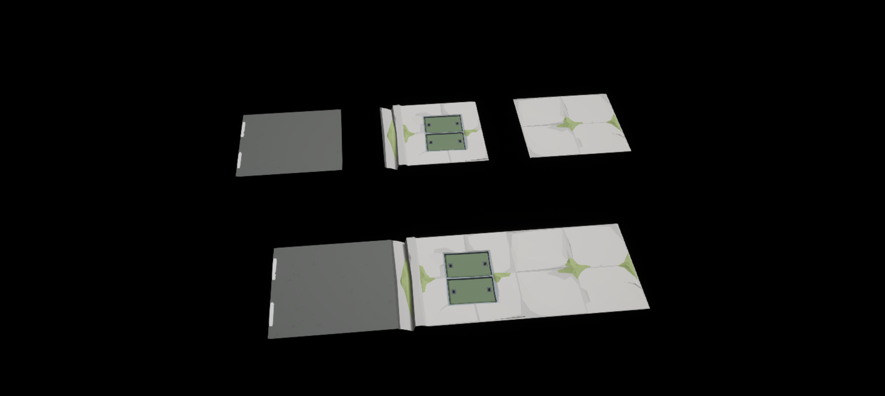
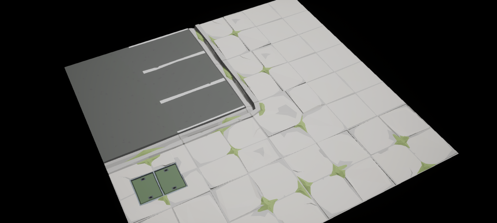
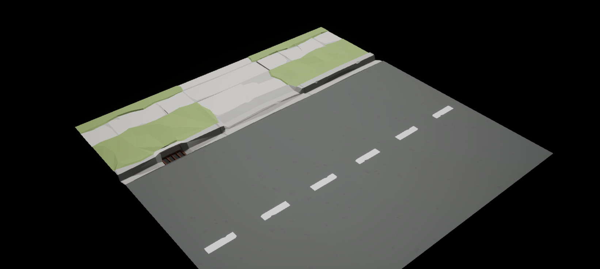
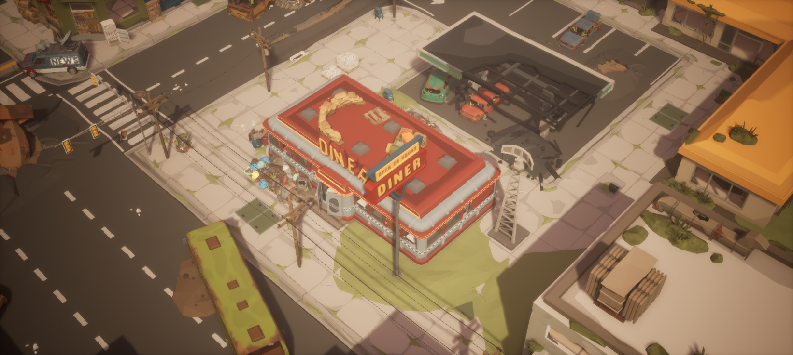
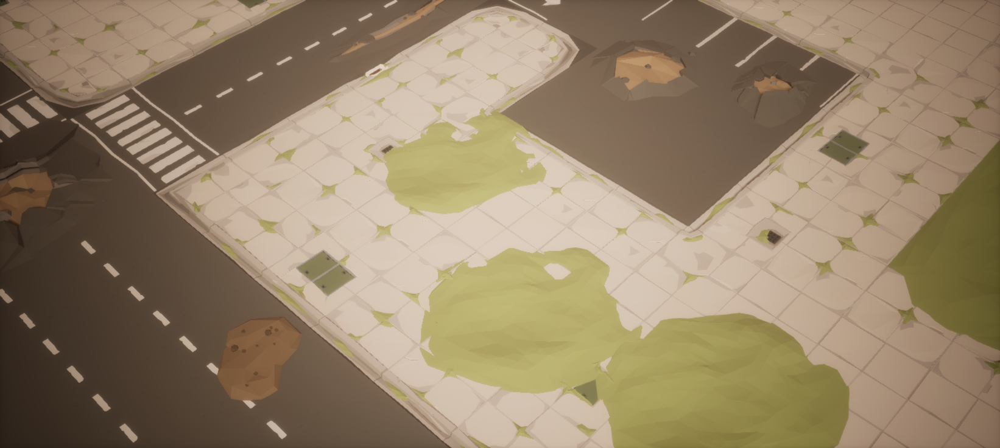
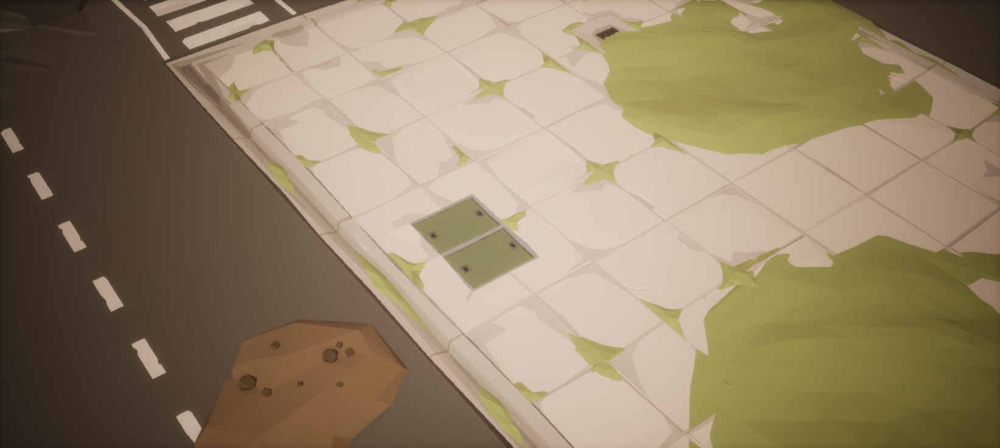
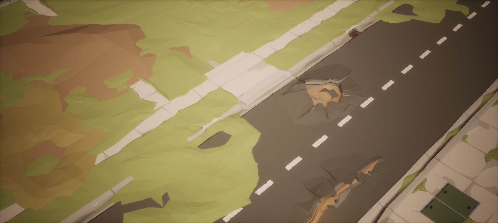

# 第一课：原包地面如何连续拼接

研究对象是 POLYGON Apocalypse v1.20.0 的 `/Game/PolygonApocalypse/Maps/Demo`，重点观察餐馆、加油区和车道入口。历史研究日期为 2026-09-14，环境为 UE 5.8.2。

核心规律是 **选择接口匹配的模块，并保持正确枢轴、方向和高度基准**。模型内部的破损细节可以不同，连接处的轮廓需要兼容。

## 30 个实例的学习样板

| 分组 | 观察内容 |
| --- | --- |
| `A_Street/01_Assembled` | 原包的一排：内部人行道、带路缘的 Panel、道路 |
| `A_Street/02_Separated_200cm` | 同样三块拆开，额外拉开 200 cm，观察各自边界 |
| `B_GasApronCorner` | 两段直路缘通过 Corner_02 转向，连接内侧停车地面和外侧人行道 |
| `C_Driveway` | Driveway_Wide_01 位于两块 Straight 之间，与道路连接 |



图中上排拆开、下排拼好，从左到右为道路、带路缘的 Panel、内部人行道。黑色区域是样板外部；研究灯光单独设置，地面使用本地原资源引用。

## 高差在模型几何里

以世界包围盒和 X=[−4500,1000]、Y=[−4500,0] cm 样区相交统计，共有 116 个地面组件，其中 103 个 Road / Sidewalk 模块的 Actor Z 都是 0，Scale 都是 1，Pitch / Roll 都是 0，Yaw 为 0、±90 或 180°。其中 101 块约 5×5 米，ParkingLines 和 Merger 各有一块约 5×10 米。

这 103 个组件的世界位置与 Actor 位置一致，有效材质与源模型一致；未直接检查原始 override 数组，因此不能排除显式覆盖为同款材质。

不能根据模型包围盒最低点逐块抬高。实测一组三块在世界 Y=−1750 cm 的截面：填充与 Panel 在 X=−900 接合，Panel 与道路在 X=−400 接合，两处边界 Z 都是 0；Panel 内部路缘顶约 +6.970 cm，槽底约 −23.029 cm，之后回到道路边界 Z=0。

沿街两端仍包含完整路缘起伏，所以也不能把这一结论简化为“所有模块四边都是 Z=0”。

## 可复现的三块配方

以下是原 Demo 的组件世界坐标，单位厘米，Scale 全部为 1。三块的世界 Y 范围都是 [−2000,−1500]。

| 模型 | Location | Yaw | 世界 X 范围 |
| --- | --- | --- | --- |
| `SM_Env_Sidewalk_01` | (−900, −1500, 0) | 0° | [−1400, −900] |
| `SM_Env_Sidewalk_Panel_01` | (−400, −1500, 0) | 0° | [−900, −400] |
| `SM_Env_Road_01` | (−400, −1500, 0) | 90° | [−400, 100] |

Panel 和 Road 可以共享枢轴位置，经旋转后占据边界两侧。此类模块的原始平面通常位于局部 X/Y=[−500,0]，世界位置按“局部坐标 × 缩放 → 旋转 → 加 Location”计算。统一网格原点后按 500 cm 移动即可，原点不必位于世界坐标 500 的整数倍。

学习 A 组将配方统一平移 (+650,+1750,0)，保留旋转、高度、缩放和材质。拆开组再向 Y 平移 1000 cm，将两侧模块分别向外移动 200 cm。

## 模块职责和接口

| 模型 | 实测职责 |
| --- | --- |
| `Sidewalk_01 / 02` | 内部填充；自带破损和草色变化 |
| `Sidewalk_Straight_01` | 5×5 m 边缘地块，自带路缘和槽形过渡 |
| `Sidewalk_Panel_01` | 完整边缘地块，不能因 Panel 名称当内部填充 |
| `Sidewalk_Corner_02` | 本次加油区使用的转角，需按边界轮廓定朝向 |
| `Sidewalk_Driveway_Wide_01` | 专用下切入口，本体仍约 5×5 m |
| `Sidewalk_Edge_01` | 独立窄路缘，约长 5 m、宽 48.55 cm，不是完整地块 |
| `Road_01 / Bare_01` | 道路或无标线路面，本样区以 Z=0 连接 |
| `Road_ParkingLines_01` | 约 5×10 m，含停车路面，不能当透明标线叠铺 |

`Panel_01` 与 `Straight_01` 在局部 Y=−500/0 的端部路缘轮廓误差约 0.001 cm，可以沿街同朝向每隔 500 cm 接续。加油区的 `Corner_02` 与一段 `Straight_02` 共享位置 (−4400,−3000,0)，Yaw 分别为 0°、90°；另一段 `Straight_02` 位于 (−4400,−2500,0)，Yaw 为 0°。



原 Demo 入口配方为 `Straight_09 (−10900,500,0)`、`Driveway_Wide_01 (−10400,500,0)`、`Straight_10 (−9900,500,0)`，Yaw 均为 −90°。



这一组合适用于原样板的接口条件。[第二课](../02-city-ground/README.md)测得它的纵向凹槽不能直接连接所选普通平边网格，因此没有照搬该入口。

## 完整场景和地面层的区别

道路与人行道通过兼容接口建立结构，再由统一材质、破损变体、建筑及杂物减少重复感。部分草色裂缝已在模块本身，不需要额外铺绿色地块。





建筑下面有原本被遮住的不规则绿色地面，不能直接作为露天院子的铺设标准。本样区相交的 5 个 `Generic_Ground_02` 位于 Z=−34/−21/−19/−18 cm，并带不规则旋转和非均匀缩放；另有两个外围 `Generic_Ground_Flat_01` 位于 Z=−26 cm。本样区没有支持“统一在 −30 cm 铺满沥青底层”的证据。





## 复现与证据

在仓库根目录运行，将工程路径换成自己的绝对路径：

```powershell
python tools/prepare_study.py --project "X:/YourProject/YourProject.uproject" --study ground-assembly
```

依赖本地 `/Game/PolygonApocalypse` 资产，构建不需要加载原 Demo。准备工具只复制学习文件，不修改工程插件配置；遇到已手改或未托管的同名文件会停止覆盖。

保存当前工作关卡后，按以下顺序操作：

1. 在 UE Python 或已有 MCP 中执行准备结果的 `build` 入口，即 `Scripts/build_learning_map.py`。
2. 保存后重新打开 `/Game/SyntySenceLearning/PolygonApocalypse/GroundAssembly/L_GroundAssembly_Study`。
3. 在 UE 中执行 `verify` 入口，即 `Scripts/validate_learning_map.py`，只读核对学习实例。

MCP 文件参数使用工具输出的工程相对路径，例如 `Learning/SyntySenceLearning/polygon-apocalypse/01-ground-assembly/Scripts/build_learning_map.py`。目标关卡已存在时保留现有内容，不以删除重建代替手工修改。

主要文件：

- [LearningMapManifest.json](Data/LearningMapManifest.json)：30 个学习实例的模型引用和摆放配方。
- [SeamAnalysis.json](Data/SeamAnalysis.json)：接口截面与端部轮廓分析摘要。
- [SourceSummary.json](Data/SourceSummary.json)：原场景测量范围和统计摘要。
- [HistoricalValidation.json](Data/HistoricalValidation.json)：原训练保存重开后 30 个实例核对与源地图保持原样的记录。

7 张截图和历史报告产生于最初研究工程，早于仓库命名空间迁移。新工程中的构建和验证应产生新的结果。原模型、完整 Demo 布局及完整几何导出不入库，需要时在本地只读测量。

仓库脚本已在 UE 5.8.2 的新学习资产目录实际运行，保存重开后 30 个实例均通过只读核对，见 [ReproductionValidation.json](Data/ReproductionValidation.json)。这份复现记录与原训练历史报告分开保存。
