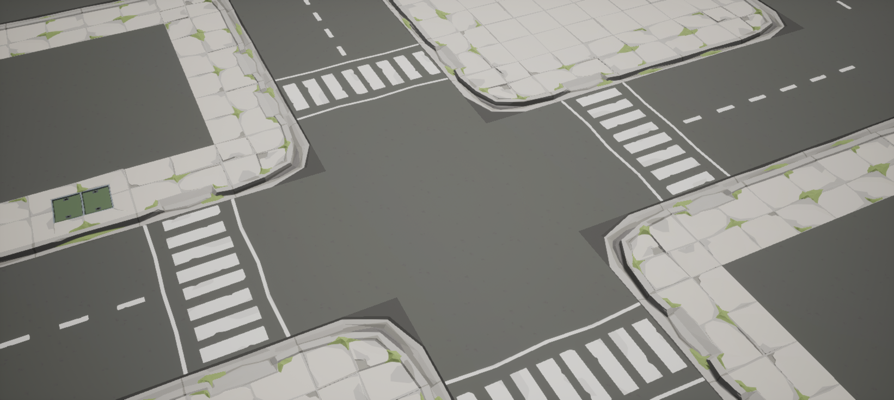
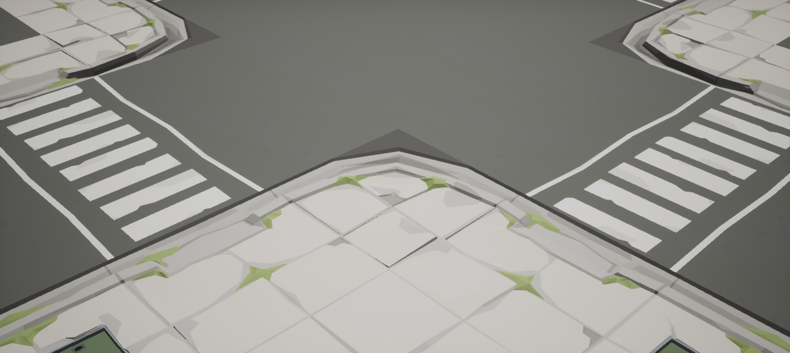
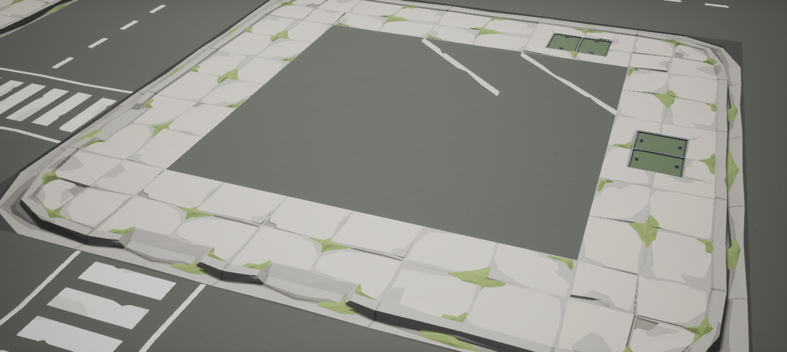
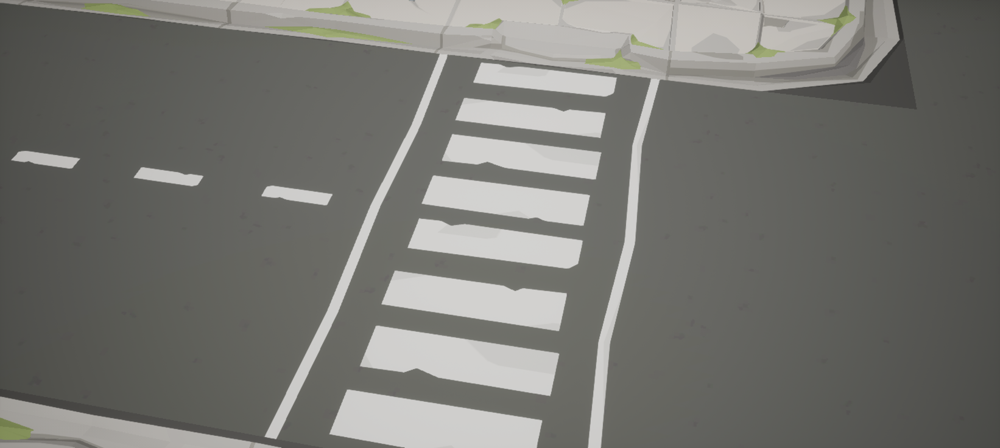
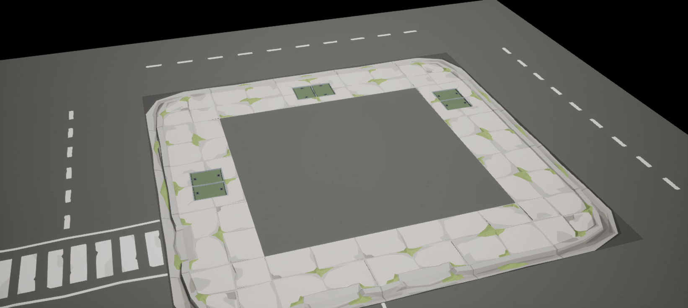
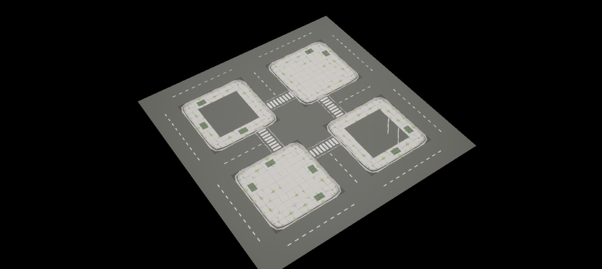

# 第二课：连续城市地面验证

本课将原包接口研究用于独立设计的 **80×80 米城市地面**。历史训练于 2026-09-14 在 UE 5.8.2 完成，使用 POLYGON Apocalypse v1.20.0。


## 布局

16×16 个 5 米格子，共 256 个原包模型实例、11 种模型。中央十字路和外围环路宽 10 米，连接四个 25×25 米街块：两处铺装广场、一处停车院、一处服务院。包含 16 个转角、4 条斑马线、8 处行人下切路缘和 2 处车行入口。

每格只有一块完整地面，没有叠加底层平面。所有地块使用源模型 Z=0、Scale=1 和角枢轴定位，Yaw 按 90°变化。80 米外缘是明确的验证边界。

## 历史实测结果

| 检查 | 结果 |
| --- | --- |
| 网格覆盖 | 256/256，无缺失和重复 |
| 相邻模块接缝 | 480/480 通过 |
| 高差阈值 | 0.1 cm，即 1 mm |
| 接缝未覆盖跨度 | 0 cm |
| 保存重开 | 实例的模型、变换和材质符合最终布局 |
| 源资产完整性 | 11 种模型、原 Demo、道路源材质及贴图共 15 个文件与原包校验值一致 |

检查对源模型 LOD0 三角形应用实际布局的旋转和平移，提取四边表面轮廓，在双方节点、曲线交点和区间端点比较高度及覆盖。作者边点的水平漂移容差为 0.01 cm；检查包括路缘和槽形起伏，不以 Actor Z 相等代替几何验证。

轮廓对齐后的最大高差约 0.00001 cm，这是指定算法和容差下的计算值。本次检查不证明模型内部所有孔洞、碰撞、导航或角色移动均无问题；近远景显示另由截图观察。

以上记录来自原研究工程。仓库已迁移生成资产的命名空间，当前 `Layout.json` 文件哈希不能直接与历史布局哈希相等比较。复现时需要对当前布局重新测量并保存结果。

## 实测失败及修正

### 直边背侧翘起

初检有 11 条失败接缝，均涉及 `Straight_02` 背边，最大错台 3.92862 cm。将其替换为接口匹配的 `Straight_01`，保留 `Panel_01` 提供同接口变化。

### 原 Demo 入口不适合当前平边网格

`Driveway_01 / Wide_01` 和 `Straight_09 / 10` 的纵向凹槽约为 2.983 cm，不能直接插入本关卡所选普通平边组合。车行入口和斑马线两端使用 `Dip_01`，前后边界回到 Z=0，沿街两端与 `Straight_01` 匹配。

这不否定第一课的原 Demo 配方，而是说明模型尺寸一致不代表任意邻接关系都兼容。

### 远景道路贴图串色

原道路贴图底部有细窄调色板，远景 mip 采样使黄色进入沥青边缘。几何对齐后仍能出现细色线。

修正方法是在学习目录派生基础材质和道路材质实例，将 `BaseTexture` 采样的 Mip Bias 设为 −3，覆盖本关卡 174 个道路材质槽。源模型、原贴图和原标线保持不变；代价是远景读取更细 mip。没有持久修改全局渲染配置。

派生材质由脚本在本地生成，位于 `/Game/SyntySenceLearning/PolygonApocalypse/CityGround/Materials`；二进制材质不存入仓库。

## 观察点

在 Outliner 中查找 `CityGround/Views` 的 CameraActor，并 Pilot 对应相机。地面实例名称包含网格坐标。

| 相机 | 观察内容 |
| --- | --- |
| `VIEW_01_Overview` | 整体路网和远景路面 |
| `VIEW_02_Junction` | 十字路口、车道线终止和四个街角 |
| `VIEW_03_Corner` | Corner、两段直边与内部填充 |
| `VIEW_04_ParkingAccess` | 停车院入口、道路和院内沥青 |
| `VIEW_05_Crosswalk` | 两块斑马线路面与两端下切路缘 |
| `VIEW_06_ServiceCourt` | 服务院入口和周边闭合路缘 |











## 复现和继续修改

先在本地 UE5 工程安装 `/Game/PolygonApocalypse` 资源并启用 Python 与 Editor Scripting Utilities。在仓库根目录运行：

```powershell
python tools/prepare_study.py --project "X:/YourProject/YourProject.uproject" --study city-ground
```

准备工具输出工程内执行入口和 MCP 相对路径。它只复制训练文件，不修改插件配置；遇到已手改或未托管的同名文件会停止覆盖。仓库已有最终 `Data/Layout.json`，首次复现无需先运行布局规划器。

保存当前工作关卡后，按以下顺序操作：

| 顺序 | 执行环境 | 入口及用途 |
| --- | --- | --- |
| 1 | UE Python / MCP | `Scripts/export_candidate_geometry.py`，只读导出本地模型几何 |
| 2 | 本机 Python | `Scripts/validate_ground_geometry.py`，验证当前布局的 480 条接缝 |
| 3 | UE Python / MCP | `Scripts/build_city_ground.py`，创建并保存关卡 |
| 4 | UE Python / MCP | `Scripts/fix_road_atlas_sampling.py`，生成并应用局部道路派生材质 |
| 5 | UE 编辑器 | 重开 `/Game/SyntySenceLearning/PolygonApocalypse/CityGround/L_CityGround_Validation` |
| 6 | UE Python / MCP | 调用 `sync_and_check_city_ground.main(sync=False)`，只读核对重开的实例 |
| 7 | UE Python / MCP | `Scripts/set_view.py`，设置观察视角，再查看近远景 |

第二步运行准备到工程内的脚本，才能读取同目录导出的本地几何：

```powershell
python "X:/YourProject/Learning/SyntySenceLearning/polygon-apocalypse/02-city-ground/Scripts/validate_ground_geometry.py"
```

第六步不要直接作为文件执行同步脚本，因为其默认入口会进行同步。可以在 UE Python 中执行：

```python
import runpy
import unreal

study_script = unreal.Paths.project_dir() + "Learning/SyntySenceLearning/polygon-apocalypse/02-city-ground/Scripts/sync_and_check_city_ground.py"
study_module = runpy.run_path(study_script)
study_module["main"](sync=False)
```

构建目标已存在时保留现有地图，不通过删除重建抹掉手工修改。修改布局后重新进行几何验证，再执行明确的同步步骤；保存并重开后仍使用只读核对。不能用同步后的结果掩盖保存失败。`plan_city_ground.py` 用于重新生成布局，调用前应先保存对布局的已有修改。

主要文件：

- [Layout.json](Data/Layout.json)：256 块地面的模型引用、坐标、朝向和用途。
- [InterfaceCandidates.json](Data/InterfaceCandidates.json)：直边、转角、入口的接口比较摘要。
- [HistoricalValidation.json](Data/HistoricalValidation.json)：原训练最终接缝结果、初检失败、保存重开及材质修正记录。
- `Scripts/`：布局规划、本地几何导出、构建、材质修正与验证脚本。

完整候选几何由本地原资源重新导出，原模型、原贴图、二进制关卡与完整几何不入库。六张截图是历史实际 UE 画面，新版本复现若有差异应记录原因及新的检查结果。

仓库脚本已经实际重新导出 18 种必要模型及反例，构建新目录下的城市地面，应用派生材质并保存重开。256 个实例的只读核对和 480 条接缝计算均通过，见 [ReproductionValidation.json](Data/ReproductionValidation.json)。以下是这次仓库脚本复现的实际截图：


