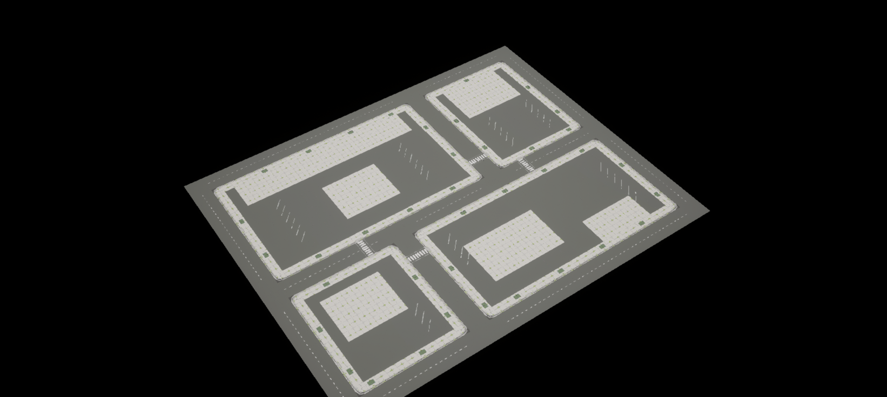
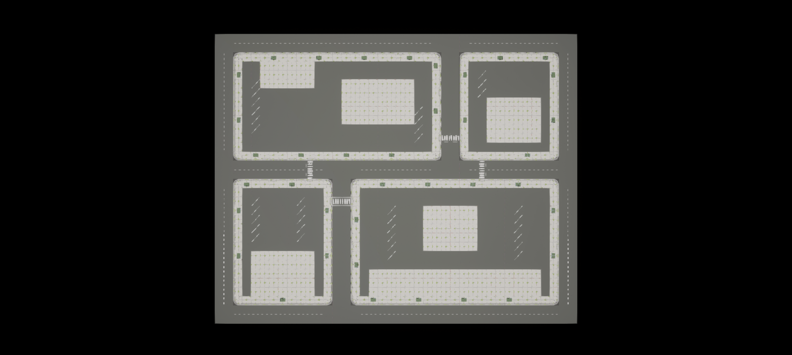
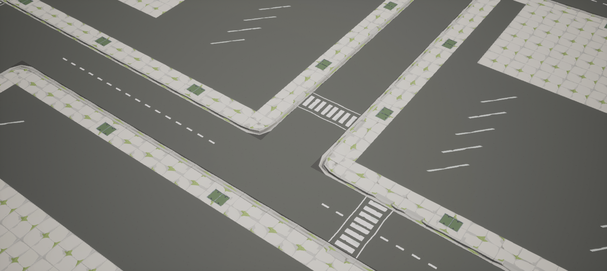
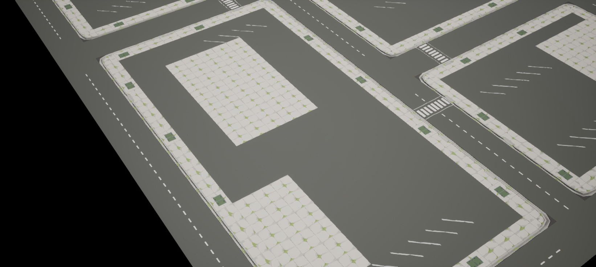
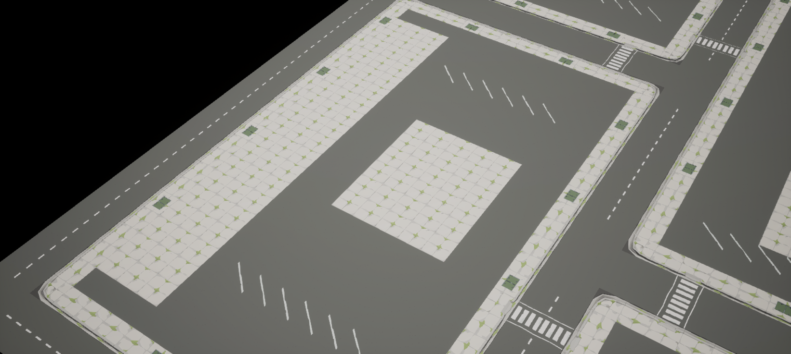
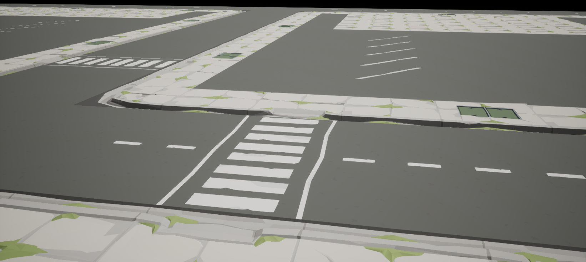

# 第三课：扩大街区并建立区域关系

本课将第二课的连续地面方法用于 **200×160 米的街区地面规划样板**，面积 32,000 平方米，为原 80×80 米测试场景的 5 倍。原测试关卡保留，新关卡使用独立目录。资源为 POLYGON Apocalypse v1.20.0，执行环境为 UE 5.8.2，训练日期为 2026-09-14。



## 扩大时怎样保持生活中的空间关系

本课继续使用已验证的 5 米地面模块，把设计重点放在道路、地块、入口以及建筑前后场的关系上。贯通街道承担东西向联系，两条短支路分别进入南北街块；两处相向 T 字路口沿主街错开 60 米，使四个街块具有不同的长度和用途。主街保留中心标线，短支路采用无中心标线路面，便于阅读两者的区别。

街块内进一步安排沥青院地、带停车标线的地面及混凝土预留区，让临街活动、内部停车和后侧服务空间具有可辨认的位置。入口使用已验证的下切路缘模型连接街道与院地；四条斑马线配对设置行人下切路缘。

这些关系是本次自创布局的设计意图，适合作为下一步逐区域学习的起点。建筑实际尺寸、地基、车辆转弯轨迹和步行尺度仍需在对应区域搭建时核对。本课道路宽度 10 米来自原包两块 5 米半幅道路模块的组合，不代表道路设计规范。

## 布局与区域预留

40×32 个格子，共 **1,280 个源模型实例、10 种模型**。每格一块完整地面，使用源模型 Z=0、Scale=1、角枢轴与 90°旋转；沿用第二课测量过的直边、转角、斑马线和下切路缘接口。

| 地块 | 尺寸 | 地面安排与后续研究方向 |
| --- | --- | --- |
| 西南：加油站与小商店 | 115×60 米 | 较大的临街沥青场地、停车标线、混凝土预留区和后侧服务通道 |
| 东南：服务院与小型商业 | 55×60 米 | 院内停车、侧向入口和集中铺装预留区 |
| 西北：饭店 | 55×70 米 | 朝向主街的前场停车、入口与后侧铺装预留区 |
| 东北：旅馆 | 115×70 米 | 较长的后侧建筑预留带、内部院落、停车地面及两侧入口 |

表中尺寸包含各街块外围的人行道；用途名称用于说明地面规划，尚未放置或测量对应建筑。布局包含 16 个街角、9 处车行入口、8 处行人下切入口和 4 条斑马线。35 块带停车标线的模型用于表达停车区域，不能据此推算实际停车位数或停车容量。

地面外缘上的道路是后续扩展接口。当前范围仍是街区样板，外缘尚未做成完整城市边界。

布局检查时取消了饭店地块一个紧邻行人入口、正对停车列的第二车行入口，保留更清楚的前场组织。这是出入口与停车关系的调整，和接缝修正分别记录。



## 接口依据与本次检查

模型搭配依据来自[第一课的原 Demo 观察](../01-ground-assembly/README.md)和[第二课的实际接缝测量](../02-city-ground/README.md)。普通人行道直边使用 `Straight_01 / Panel_01`，转角使用 `Corner_01`，出入口使用 `Dip_01`。第二课已经发现 `Straight_02` 背边存在错台，`Driveway_01 / Wide_01` 及 `Straight_09 / 10` 属于另一组凹槽接口，不能直接替换本布局的平边组合。

扩大后的布局重新读取源模型 LOD0 三角形，应用每个实例的真实变换，比较相邻边界的覆盖与高度轮廓；检查包含路缘和沟槽的起伏。

| 检查 | 本次结果 |
| --- | --- |
| 网格覆盖 | 1,280/1,280，无缺失或重复 |
| 相邻接缝 | 2,488/2,488 通过 |
| 接缝高差阈值 | 0.1 cm，即 1 mm |
| 几何边点水平漂移容差 | 0.01 cm |
| UE 构建 | 已生成 1,280 个源模型实例 |
| 道路材质修正 | 局部派生材质已应用到 846 个道路材质槽 |
| 保存重开后只读验收 | 切到原 80 米关卡后重开本课；1,280 个实例的模型、位姿、Scale=1 与材质核对零失败 |
| 源资产完整性 | 本次复核的 15 个源文件与下载原包的 SHA256 一致 |

道路材质沿用第二课的 atlas 远景采样修正：在本课独立目录派生基础材质与材质实例，将 `BaseTexture` 的 Mip Bias 设为 −3。源模型、原贴图、源材质不被覆盖；较细的远景 mip 采样仍需在项目实际运行条件下评估。

补充检查对 10 种源模型分别以 5 cm 和 1 cm 间隔抽样内部 XY 覆盖，共约 260 万个采样点。`Corner_01` 后侧铺装的细小区域出现未覆盖点：粗采样 7/10,000，细采样 160/250,000（0.064%）；其余 9 种模型在这两轮取样中未发现未覆盖点。这里保留原包几何，这一源模型内部特征与本次实例之间的接缝分别评估。抽样计入所有非竖直三角面的投影，不检验可见顶面，也不等于对所有内部位置的连续证明。

完整几何输出由使用者在本地从已有资源生成。2,488 条边界接缝通过不代表模型内部绝对无孔洞；本课也未完成碰撞、导航、车辆通行、建筑适配、游戏交互或大场景性能验收。

本课从当前仓库布局直接开始训练，没有另一个旧命名空间的历史版本。`study.json` 的 `historical_evidence` 与 `reproduction_evidence` 指向同一份本次执行记录，不代表完成了两次独立验证。

实际结果见 [ReproductionValidation.json](Data/ReproductionValidation.json)。其中布局哈希对应本课当前 `Data/Layout.json`；保存重开核对使用 `sync=False`，没有先修正实例再报告通过。

## 观察点

在 Outliner 的 `CityGround/Views` 中 Pilot 相应 CameraActor，或使用 `Scripts/set_view.py` 的 `view()` 函数切换。

| 相机 | 观察内容 |
| --- | --- |
| `VIEW_01_Overview` | 总体规模、主街、支路与不同街块比例 |
| `VIEW_02_NorthT` | 北侧 T 字路口与斑马线 |
| `VIEW_03_SouthT` | 南侧 T 字路口、主街标线终止及院落入口 |
| `VIEW_04_GasAndShops` | 加油站与商店地块的前场、入口和后侧空间预留 |
| `VIEW_05_Diner` | 饭店地块的前场停车与后侧铺装 |
| `VIEW_06_Motel` | 旅馆地块的院落、停车地面和建筑预留带 |
| `VIEW_07_Pedestrian` | 近景斑马线与下切路缘衔接 |
| `VIEW_08_Top` | 四个不等长街块和错开的两个 T 字路口 |









## 复现步骤

本地 UE5 工程需安装 `/Game/PolygonApocalypse` 资源，并启用 Python Editor Script Plugin 与 Editor Scripting Utilities。在仓库根目录执行：

```powershell
python tools/prepare_study.py --project "X:/YourProject/YourProject.uproject" --study expanded-neighborhood
```

准备工具把文件复制到工程内 `Learning/SyntySenceLearning/polygon-apocalypse/03-expanded-neighborhood`，输出 MCP 相对入口，遇到手工修改或未托管的同名文件会停止覆盖。首次复现直接使用仓库的 `Data/Layout.json`；`Scripts/plan_neighborhood.py` 可重新生成当前配方，运行前应先保留已有布局修改。

保存当前工作后，按顺序执行：

| 顺序 | 环境 | 操作 |
| --- | --- | --- |
| 1 | UE Python / MCP | `Scripts/export_candidate_geometry.py`，只读导出布局模型及接口反例的 LOD0 几何 |
| 2 | 本机 Python | `Scripts/validate_ground_geometry.py`，验证 40×32 网格覆盖与 2,488 条相邻接缝 |
| 3 | UE Python / MCP | `Scripts/build_city_ground.py`，生成独立关卡与观察相机 |
| 4 | UE Python / MCP | `Scripts/fix_road_atlas_sampling.py`，生成并应用本课道路派生材质 |
| 5 | UE 编辑器 | 保存并重开 `/Game/SyntySenceLearning/PolygonApocalypse/ExpandedNeighborhood/L_ExpandedNeighborhood` |
| 6 | UE Python / MCP | 调用 `sync_and_check_city_ground.main(sync=False)`，只读核对重开的模型、变换与材质 |
| 7 | UE Python / MCP | `Scripts/set_view.py`，观察总览、各区域及近景接缝 |

第二步使用准备到工程内的脚本，读取同目录导出的几何：

```powershell
python "X:/YourProject/Learning/SyntySenceLearning/polygon-apocalypse/03-expanded-neighborhood/Scripts/validate_ground_geometry.py"
```

第六步不要直接执行同步脚本的默认入口，因为默认值会修改实例。只读核对调用方式为：

```python
import runpy
import unreal

study_script = unreal.Paths.project_dir() + "Learning/SyntySenceLearning/polygon-apocalypse/03-expanded-neighborhood/Scripts/sync_and_check_city_ground.py"
study_module = runpy.run_path(study_script)
study_module["main"](sync=False)
```

构建器在目标关卡已存在或编辑器有未保存资产时停止，保留现有工作。修改布局后先重新验证几何，再按需要显式同步；保存重开后仍以只读模式验收。

仓库保存[布局引用与分区说明](Data/Layout.json)、脚本、实际 UE 截图以及本次验证摘要。记录来自已安装资源的现有 UE 5.8.2 工程，尚未测试全新引擎安装。原资源、完整几何和本地生成的二进制关卡及材质不入库。
