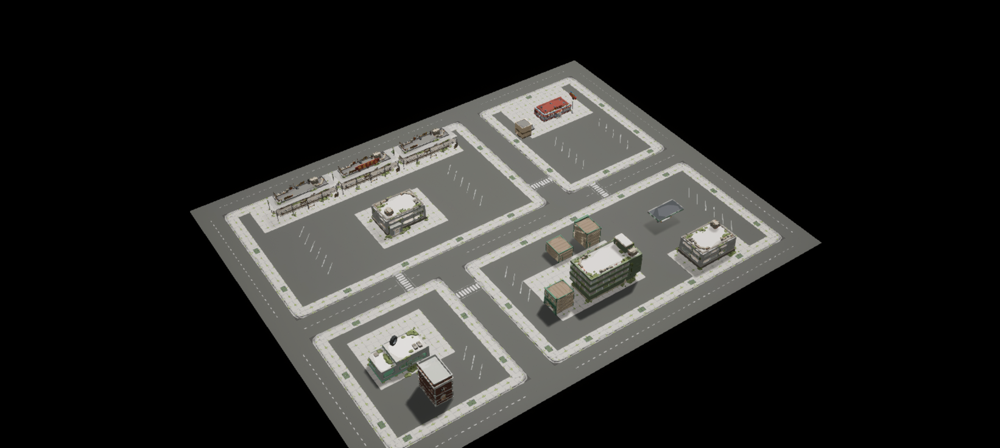
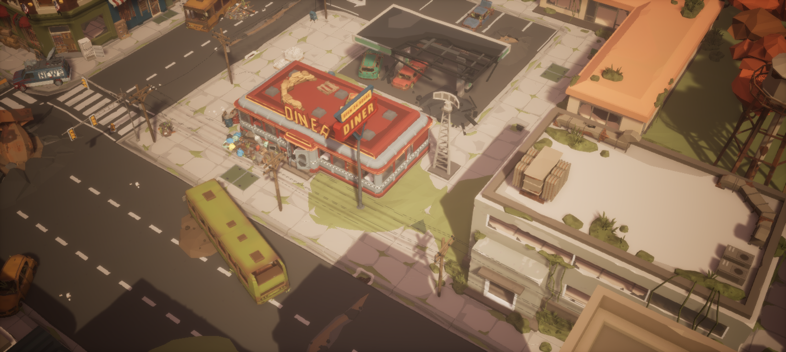
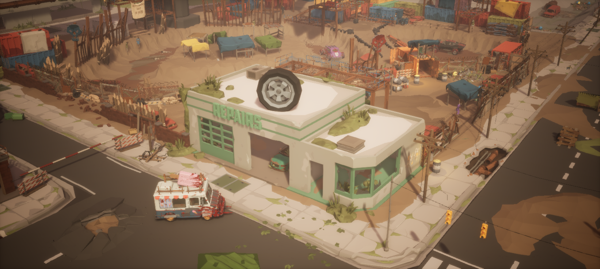
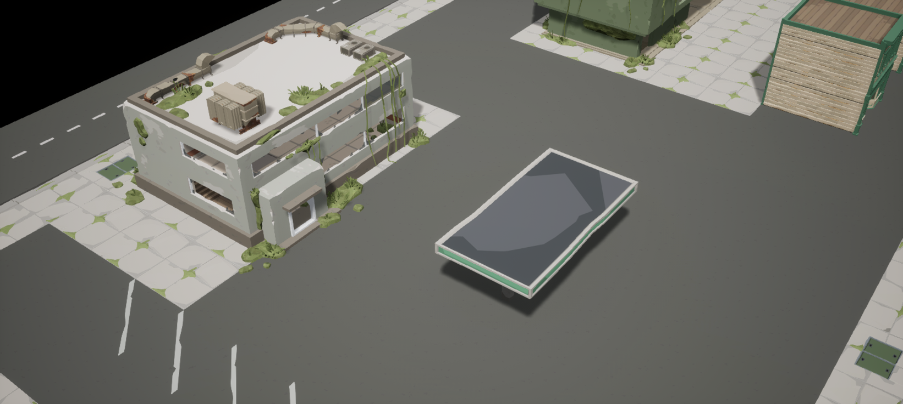
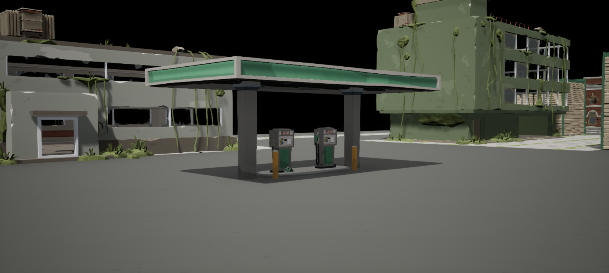
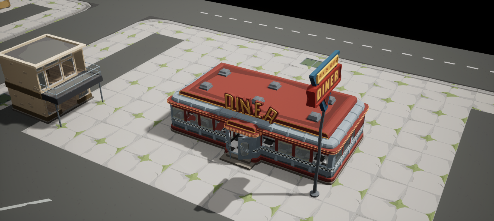
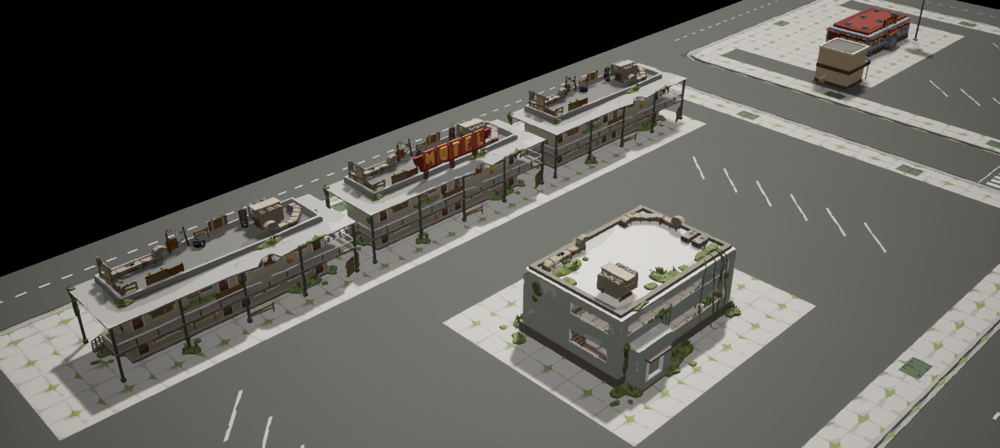
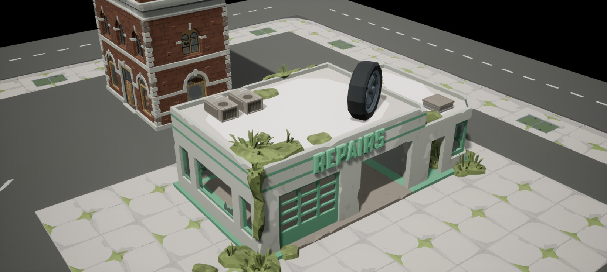
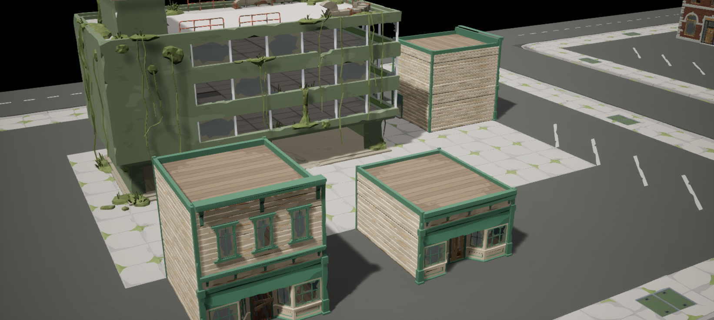

# 第四课：从原包装配方式学习建筑摆放

本课在[第三课的 200×160 米街区](../03-expanded-neighborhood/README.md)中加入加油站、饭店、旅馆、修车店和临街商铺。先观察原 Demo 中建筑主体、玻璃、门和附件的实际组合，再记录相对变换，并把这些小型装配用于自创街区。研究资源为 POLYGON Apocalypse v1.20.0，执行环境为 UE 5.8.2，日期为 2026-09-14。

本课接着修改第三课的既有关卡 `/Game/SyntySenceLearning/PolygonApocalypse/ExpandedNeighborhood/L_ExpandedNeighborhood`，新增建筑，不另建地图。第三课的 1,280 块地面配方保留；本地在添加建筑前保存了地图备份，二进制备份不入库。复现时先完成第三课，再执行本课。



## 原 Demo 教给我们的装配方法

建筑名称相似，不代表所有零件都可以放在同一位置。观察时需要把零件分为共枢轴附件、独立枢轴部件，以及需要保留缩放或镜像的部件，再检查每一种实际关系。

| 零件关系 | 本次观察 | 摆放方法 |
| --- | --- | --- |
| 共枢轴附件 | 饭店主体、固定玻璃和室内结构共用位置；旅馆的附件、路障、蔓生植物和招牌与主体基本同枢轴 | 保留原模型的相对位置和朝向，整组旋转；不要按各自包围盒重新居中 |
| 独立门枢轴 | 饭店双门各有铰链位置；旅馆七扇样板门分别位于两层；修车店门的枢轴在上沿 | 记录相对主体的位置、旋转和高度，保留门的开闭状态 |
| 镜像与局部缩放 | 饭店一扇门及门玻璃使用 X=-1 镜像；独立招牌和部分封板门使用原场景的局部缩放 | 主建筑保持 Scale=1，门和招牌沿用测得的原配方，不能把全组强制重置为同一缩放 |
| 同类模型的例外 | 额外抽查的 `SM_Bld_Shop_Large_01` 玻璃相对主体偏移约 (+51.589, -49.793, +630.608) cm | 逐个型号测量；此型号未用于当前布局，该偏移不能套给 `Shop_Large_02` |

这里记录的是源 Demo 中选定的局部组合，并非完整源场景布局。当前 [Assemblies.json](Data/Assemblies.json) 保存 10 套相对装配配方；9 套取自原场景小型样板，完整加油棚是本次使用原包模型的新组合。有限测量依据见 [SourceAssemblyMeasurements.json](Data/SourceAssemblyMeasurements.json)：包含源实例变换比较、模型尺寸，以及在指定局部 XY 位置用 LOD0 三角形求交取得的入口表面高度；这些点样本不等于整个室内表面的连续验证。

### 饭店：Actor 的零高度不等于室内地坪

`SM_Bld_Diner_01` 主体约 10.45×16.03 米，正面朝模型局部 +X。主体 Actor 采用 Z=0；实测室内地坪约为局部 Z=46.07 cm，入口两级踏面约为 19.81 cm 和 43.54 cm，门槛约为 47.80 cm。这些高度是模型已经做好的入口关系，不能因为室内地坪较高就把整个建筑向下埋进街区地面。

双门的独立枢轴位于局部 Z=156 cm，门几何底部约为 Z=48.12 cm。枢轴位于门中上部，和门底高度不同；门框、门扇与门玻璃要一起核对。两扇门保留原 Demo 不同的打开角度，其中一组门扇与玻璃保留 X 轴镜像。固定窗玻璃与室内结构则与建筑主体共枢轴。

本次饭店配方包含 23 个部件，也保留了源样板的部分桌椅和招牌。它能说明装配关系，尚未构成完整可交互室内场景。



### 旅馆：先分清主入口面，再安排院落

`SM_Bld_Motel_01` 主体约 8.93×27.61 米，正面为模型局部 +X。附件、路障、蔓生植物和招牌基本共枢轴；原样板的七扇关闭门是独立实例，局部 Z 约为 22.40 cm 或 322.40 cm，反映两层门的位置。七扇门是所采样原装配中的部件数量，不是对旅馆房间容量的统计。

本次用三组旅馆沿地块后侧排列，统一转向院落，并用另一组小型商业建筑表达接待区域。屋顶 `MOTEL` 字牌只保留中间一组，避免相邻三栋重复同一块识别牌。主体的长边、廊道和入口关系决定了朝向与退距；不能只把屋顶轮廓塞进地块后再补出入口。源样板中保留的封堵和植被属于末日美术状态，后续需要开放房间时应另做门、碰撞和通行研究。


### 修车店：顶部门轴需要保留真实姿态

`SM_Bld_AutoRepair_01` 主体约 10.80×19.73 米，正面为局部 +X。玻璃与蔓生植物共枢轴，两扇车库门使用独立枢轴：局部 Z 约为 397.47 cm，一扇门 Pitch=-90°，另一扇为 0°。源样板关闭门的几何底部约为 21.60 cm；不能把顶部门轴按地面零高度摆放，也不能用统一 Yaw 替代它的开启旋转。

本图修车店还加入原场景测得的轮胎识别牌 `Sign_Wheel` 和修理文字牌 `Sign_Repairs`，分别保留约 0.81924 与 1.49477 的原配方缩放，使正面更容易辨认。本图修车店整组采用 Z=1 cm，其余建筑主体及加油棚组采用 Z=0。这个小偏移明确保存在布局中，不表示所有建筑都需要抬高，也不表示已经验证车辆能够跨越门槛。



### 加油棚：原包有完整版本，但源 Demo 用法不能直接等同

原包提供 `SM_Prop_Gaspump_Cover_01` 完整棚顶，约 7.01×13.38 米；`SM_Prop_Gaspump_Base_01` 油岛约 2.17×5.77 米。本次两者共枢轴，加油机放在局部 Y=-150 cm 与 +150 cm 的位置，油岛两侧留出车辆活动空间。

所观察的源 Demo 没有使用这套完整棚顶。本次是根据实际模型尺寸和源场景的加油机相对间距建立的新组合，不能称为源 Demo 整套原样复刻。完整棚顶与油岛单独组成一组，没有把烧毁版本的残片混入这套完整结构。场地出入口沿用第三课；车辆转弯和进站、离站路径仍需后续用实际车辆检查。

本次加油机保留源样板的 Actor Z=0；油岛台面约为 Z=15.10 cm，完整加油机模型底部约为 Z=8.55 cm，底座会小幅嵌入油岛。测量摘要同时记录了精确接触所需的约 +6.56 cm 高度，但当前布局没有采用该派生值。棚柱与油岛底部也建有延伸到地面以下的几何，不能用包围盒最低点一律吸附到地面。

## 本次怎样放进既有地块

[Plan.json](Data/Plan.json) 保存 14 个装配组的锚点、转向与主体尺寸；[Layout.json](Data/Layout.json) 将装配展开为 94 个静态网格实例，共引用 50 种模型。13 个实例为建筑主体，另有 1 个加油棚主体，其余是玻璃、门、附件、加油机及少量饭店室内零件。

| 区域 | 本次放置 | 空间安排 |
| --- | --- | --- |
| 西南：加油站与商铺 | 加油站服务建筑、完整加油棚、一个中型商业建筑和三间小店 | 加油区和商业前场分开，商店朝向前场或支路，保留地块内通道 |
| 西北：饭店 | 一间饭店和一间咖啡店 | 饭店朝向前场，咖啡店朝向区域内部，利用既有停车与铺装空间 |
| 东北：旅馆 | 三组旅馆和一栋接待用途建筑 | 旅馆沿后侧排列，面向内部院落，前侧建筑表达接待区域 |
| 东南：服务院 | 一间修车店和一间零件商店 | 修车店面向院地，商店保留侧向前场，避免建筑挤占路边通行空间 |

这些用途是当前自创布局的区域表达，不代表资源包已有对应的经营或交互功能。主建筑与加油棚均保留原尺寸；通过锚点、朝向、前场和相邻建筑间距适应地块，没有拉伸建筑来填满预留区。

检查初稿时，零件商店后侧与街块内部东边界之间仅约 3.36 米，这片空间紧邻服务院的东侧车行入口。商店自身正面朝西；需要留宽的是从地块东入口进入、再转向北侧修车区的院地。将该组锚点 X 从 7,800 cm 调整至 6,500 cm 后，东侧空间增至约 16.36 米。这个案例说明：主体没有重叠、没有压上道路，仍可能挤窄区域的进入路线。包围盒用于发现空间冲突，建筑门口和地块入口需要分别观察；最终可用净宽还要结合台阶、招牌、碰撞和车辆尺寸检查。













## 验证范围

构建脚本在修改前核对当前地图、未保存资产状态、1,280 块地面的数量、第三课地面配方哈希和原包资产引用。建筑使用专用标签与文件夹组织；再次直接执行构建脚本会因已存在本课建筑而停止，避免重复添加。

只读验收逐一核对建筑实例的标识、模型、位置、旋转、缩放和材质，并逐格检查原地面的模型、位置、旋转和 Scale=1。旋转通过方向轴比较，允许欧拉角的等价表示，避免将修车店 Pitch=-90° 时不同的角度表示误判为姿态错误。

最终保存重开已完成：先切换到原 80 米测试地图，再重开当前街区，运行只读脚本。结果见 [ReproductionValidation.json](Data/ReproductionValidation.json)，空间检查详情见 [PlacementAudit.json](Data/PlacementAudit.json)。

| 检查 | 本次实际结果 |
| --- | --- |
| 保存重开后的建筑装配 | 94 个部件、50 种模型；13 栋主建筑和 1 个加油棚，模型、变换与材质核对零失败 |
| 原地面摆放 | 1,280 个实例的模型、位置、旋转、缩放与第三课配方核对零失败 |
| 主体占地与入口空间 | 检查 14 组主体、91 对主体间关系和 9 个地块车行入口的向内投影；修正东侧入口空间后无报告问题 |
| 源资产完整性 | 本次抽查 55 个源文件，包括源 Demo、引用模型与材质实例；工程文件和下载原包 SHA256 均一致 |

本课的 `historical_evidence` 与 `reproduction_evidence` 指向同一份当前执行记录，不代表两次独立验证。该记录中的布局哈希对应本课当前 `Data/Layout.json`。

本课核对的是建筑装配和既有地面摆放未变。第三课的 2,488 条地面接缝已经单独测量，本课不把那项历史结果写成一次新的接缝测量。建筑主体包围盒检查用于筛查占地和间距，不是建筑墙体的精确轮廓，更不等于车辆转弯、角色碰撞、导航、室内可达性、交互或性能验收。

## 复现步骤

需要已授权安装 `/Game/PolygonApocalypse` 的 UE5 工程，并启用 Python Editor Script Plugin 与 Editor Scripting Utilities。先按[第三课步骤](../03-expanded-neighborhood/README.md#复现步骤)构建、修正材质、保存并验收地面。第三课脚本和 `Data/Layout.json` 需要保留在工程学习目录，供本课检查依赖。

在仓库根目录执行：

```powershell
python tools/prepare_study.py --project "X:/YourProject/YourProject.uproject" --study expanded-neighborhood
python tools/prepare_study.py --project "X:/YourProject/YourProject.uproject" --study building-placement
```

准备工具只复制学习文件，不会自动执行第三课或添加建筑。两课的文件分别位于工程 `Learning/SyntySenceLearning/polygon-apocalypse/` 下对应目录。本课构建使用已保存的布局配方，不需要载入源 Demo。

| 顺序 | 环境 | 操作 |
| --- | --- | --- |
| 1 | UE 编辑器 | 打开第三课 `L_ExpandedNeighborhood`，保存当前地图和资产；首次添加前保留本地地图备份 |
| 2 | UE Python / MCP | 执行 `04-building-placement/Scripts/build_buildings.py`，一次添加建筑与观察相机，并保存既有关卡 |
| 3 | UE Python / MCP | 执行 `04-building-placement/Scripts/verify_buildings.py`，只读检查建筑装配与原地面 |
| 4 | UE 编辑器 | 切换到另一张已保存地图，再重开 `L_ExpandedNeighborhood` |
| 5 | UE Python / MCP | 再执行 `verify_buildings.py`，保留保存重开后的实际输出 |
| 6 | UE Python / MCP | 执行 `set_view.py` 查看总览，调用 `view()` 查看区域近景 |

如需改变布局，先保留自己的修改，再运行本机 Python 脚本 `plan_buildings.py` 重新展开配方。它写入本课的 `Data/Plan.json` 与 `Data/Layout.json`，不直接操作 UE。修改配方后，已有地图不会自动同步；应针对现有实例做明确调整，再用只读脚本验收。不要重复运行首次添加脚本尝试同步。

在 Outliner 的 `Buildings/Views` 中可以 Pilot 以下相机，也可以用 `set_view.py` 的 `view(name)` 切换。

| `name` | 观察内容 |
| --- | --- |
| `01_Overview` | 建筑密度、四块区域和道路关系 |
| `02_MainStreet` | 沿主街观察建筑朝向与街区轮廓 |
| `03_GasStation` | 完整加油棚、油岛和服务建筑 |
| `04_Diner` | 饭店入口、玻璃、招牌和前场 |
| `05_Motel` | 三组旅馆、接待区域与院落 |
| `06_AutoRepair` | 修车店双门和前侧作业空间 |
| `07_Shops` | 临街商店、玻璃和封板门 |
| `08_GasEntry` | 加油棚下的油岛和加油机近景 |

仓库保留小型相对装配配方、自创摆放布局、脚本、有限测量结论和实际 UE 截图。原始或派生的 `.uasset` / `.umap`、完整源几何、源 Demo 布局及本地备份不入库。本次记录来自已安装资源的现有 UE 5.8.2 工程，未验证全新引擎安装。
