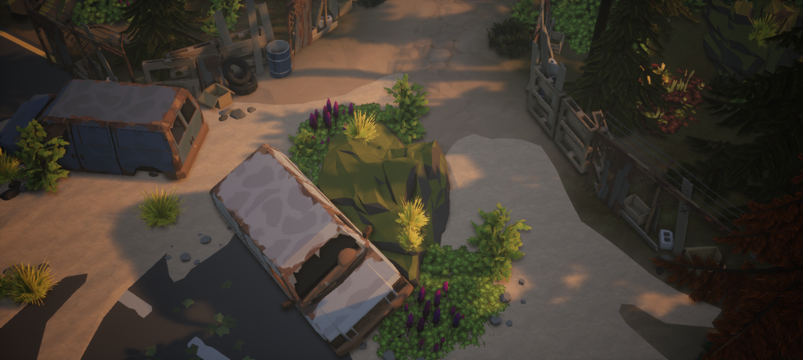
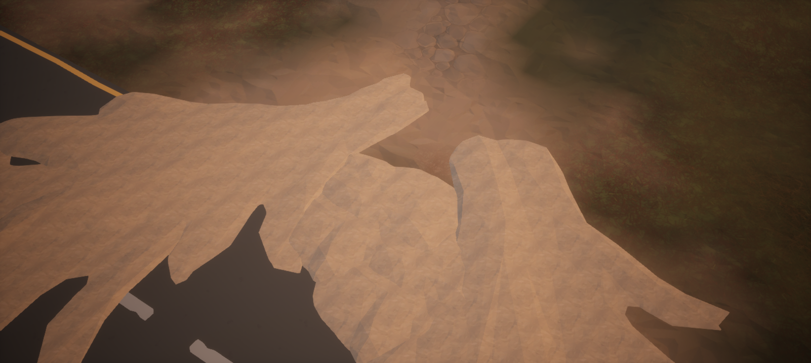
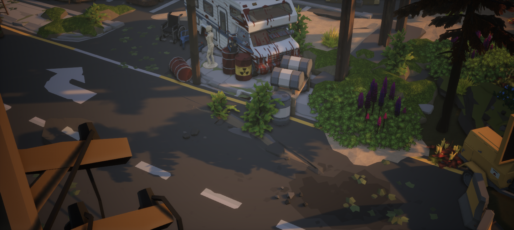
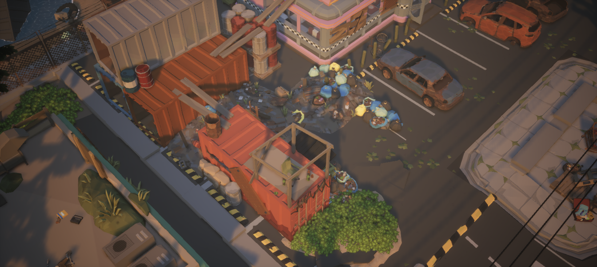

# 从完整 Woodland 节点重新学习末日地面

2026-09-15，研究原 Woodland Demo，不改动自建小城。环境为 UE 5.8.2；Woodland 1.0.0、Apocalypse 1.21.1、Alpine 1.1.0 均为 UE5.3 资源版本。此前依赖缺失及恢复过程见 [SourceMapStudy.md](SourceMapStudy.md)。

重新读取完整原图后得到 5,697 个 Actor、5,621 个有效静态网格组件、677 种模型、51 个贴花组件，空网格组件为 0。本次从中选择三个局部、共 45 个模型节点，检查实际组件、世界变换与材质覆盖；测量其中 26 个实例的 LOD0 三角面，以及 196 个位置的 Landscape 碰撞参考高度和绘制权重。完整节点和几何导出留在本地。

最重要的学习结果是：先建立相互匹配的底面，再用破损、积土和成组细节形成局部变化。原图中也存在依赖车辆、植物遮挡的土片边缘；不能把一块看起来合适的土片沿所有路边重复摆放，就认为完成了连续地面。

## 一、土层侵入道路：底面高度、材质绘制、模型重叠一起起作用

位置在西侧道路附近，研究横截面为世界 Y=-1000 cm。当前 `SM_Env_Road_YellowLines_02` 的本地范围是 X=0…500、Y=-500…0；原图节点 `StaticMeshActor_8916` 位于 (-500,-850,25)，所以道路覆盖 X=-500…0、Y=-1350…-850。旧 Apocalypse 1.20 同名模型的枢轴方向不同，不能套用旧边界。

第二张是诊断视图，不是完成效果：在局部范围临时隐藏 1,289 个非道路／路边／土片网格 Actor，截图后逐一恢复原可见状态，差异为 0，地图和内容脏包均为 0，没有保存原图。可见宽土片有硬轮廓和重叠；完整组合通过地形绘制、车辆、岩块及植物改变这些轮廓的显露范围。

### 实测截面

所有高度单位为 cm。Landscape 数值来自只命中地形的复杂碰撞查询，碰撞 mip=0；模型数值来自当前 LOD0 世界三角面求交。两者的证据类型不同，不能称为逐顶点渲染接缝验收。

| XY 采样点 | Landscape 高度参考 | 路面 LOD0 | 土片 9912 LOD0 | 说明 |
| --- | ---: | ---: | ---: | --- |
| (-1000,-1000) | 24.194 | — | — | 已绘为 Dirt；在道路外侧承托地表 |
| (-700,-1000) | 24.194 | — | 25.652 | 小土片从地形上方露出 |
| (-600,-1000) | 24.194 | — | 33.022 | 土片隆起，不是平面贴花 |
| (-500,-1000) | 24.194 | 25.000 | 31.352 | 同一土片跨过路边，覆盖路面 |
| (-400,-1000) | 24.194 | 25.000 | 34.046 | 土比路高约 9.05 cm |
| (-300,-1000) | 24.194 | 25.000 | 29.035 | 土比路高约 4.03 cm |
| (-200,-1000) | 5.801 | 25.000 | — | 土片已离开此采样点，道路继续遮住下方地形 |

所选路边附近 Landscape 与路面只差约 **0.81 cm**。这是这个截面的观测，不是全图统一数值，也不是建议所有区域照抄 Z=24.19。

`StaticMeshActor_9912` 使用 `SM_Gen_Env_Ground_Dirt_03`，位置 (-500.7,-1000.2,21.3)，缩放 (0.533,0.533,0.3749)。Actor Z=21.3 低于路面，但它的实际顶面可高出路面约 9 cm。必须按顶面和轮廓判断，不能只比较枢轴。

Landscape 绘制也在变化：同一截面 X=-1400 时 Grass_02=1；X=-1200 时约 Dirt=0.288、Grass_02=0.678，另有少量 Pine_Dirt/River_Rock_01；X=-1000 时 Dirt=1。这些是绘制层输入权重，不是最终画面面积或颜色比例。在土片及道路下方，即使地形绘为草也可能被上层遮住。

还读取了附近三个 `SM_Gen_Env_Road_Gravel_End_01`。不能因其存在就把所有过渡归功于它：例如 (-900,-1000) 的 10019 顶面仅约 14.91 cm，低于该处地形参考 24.19 cm；它在这个位置是埋在下方的。复用前必须区分实际露出部分和被覆盖部分。

**可复用方法：** 先让承托地形接近要衔接的路边高度，在外侧绘制草土变化；随后用少量有厚度的小土片跨越边界，检查露出高度和覆盖范围；最后将车辆、石块与植物安排在有用途的位置。大土片适合局部积土或覆盖区域，其轮廓需要结合整个组合判断。

## 二、破损路面与沟槽：保留规则接口，在接口内部做变化

位置约 (-500,-8350,25)。17 个选定节点都是独立 StaticMeshActor，网格组件没有父组件，并非一个自动拼接 Blueprint。

沿路西侧，三种模块均 yaw=-90°、缩放 0.5，占用 X=-750…-500 的 2.5 m 侧带：

| 顺序 | 节点及模型 | 世界 Y 范围 | 用途与证据 |
| --- | --- | --- | --- |
| 1 | 9633 · Sidewalk_Driveway_Wide_01 | -8850…-8600 | 车道入口截面；在 Y=-8725、X=-600 的顶面约 Z=23.39 |
| 2 | 9598 · Sidewalk_Dip_01 | -8600…-8350 | 降低的路边截面；在 Y=-8475、X=-525 的顶面约 Z=17.36 |
| 3 | 9769 · Sidewalk_Gutter_01 | -8350…-8100 | 带排水细部的模块；在 Y=-8225、X=-525 的顶面约 Z=11.57 |

三块 Actor Z 均为 25 cm，实际内部截面却不同。在 Dip/Gutter 共享边界 Y=-8350 两侧各偏移 0.1 cm、沿宽度选 7 对点，当前 LOD0 顶面最大差约 **0.051 cm（0.51 mm）**。这说明所选模块能保留匹配接口；不代表全边界、碰撞或所有同系列模块已经验收。

`StaticMeshActor_8968` 使用 `RoadPiece_Damaged_04`，pitch 约 -0.715°、roll 约 -3.265°，跨越两个平路模块。相同破损片在 (-400,-8225) 顶面约 32.27 cm，高出 Z=25 的路面；在 (-400,-8475) 顶面约 24.19 cm，又低于完整路面。由露出与埋入形成断续破损轮廓，不是把整个破损片架空放在路上。

这里也有 `Ground_Dirt_03` 跨车道入口：(-600,-8725) 土片约 Z=31.33，而入口模块约 Z=23.39。要保留入口坡形和可识别轮廓，不能把所有坡口铺成同样厚的土。

**不要把 bounds 的最低点当成可见沟深。** Gutter 的 bounds 最低约 Z=-31.54，其中一些低面被本体上表面遮住。补测的五个开口位置，Landscape 碰撞参考均为 Z=-17.009；部分低面比该参考还低。这里只记录相对高程，尚未做这些开口的近景渲染穿插验收，也没有证明它是完整可通水的沟渠系统。

**可复用方法：** 先选功能正确、接口匹配的道路与路边模块；确认坡口及沟槽的真实截面和下方空间；再局部插入倾斜破损片、积土、植物。规则模块保障基础关系，细节决定哪里仍能识别道路、哪里已被侵入。

## 三、垃圾堆与植物：识别资源作者准备好的组合

餐厅南侧停车区与集装箱围挡旁选择了 18 个节点。这里用垃圾箱、围挡、成组碎物和局部灌木组织细节；车行区域仍有空地，密度不是均匀分布。

| 组合 | 实际节点关系 | 搬运规则 |
| --- | --- | --- |
| Dumpster_02 + Dumpster_Rubbish_01 + Dumpster_Rubbish_TrashBag_01 | 10600／10605／10609 完全共变换，位置 (1694.5,-1989.2,73.4)，旋转 0、缩放 1 | 可按同一组变换摆放；垃圾层包括箱底周围，不应全解释为箱内物体 |
| TrashPile_10 + Trash_10 + Grass_10 | 11164／11110／10751 完全共变换，位置 (2166.6,-2064.1,75.0006)，旋转 0、缩放 1 | 底堆、细碎物和草构成一个完整局部组合，保留共同基准 |
| TrashPile_06 + Rubble_Grass_06 + Rubble_Trash_06 | 11153／11224／11226 为独立位置；草相对底堆偏移 (-3.536,27.821,37.269)，碎物偏移 (10.689,-13.692,58.611) | 保留附件相对位移，不能把三者都吸附到同一地面高度 |

这些都是实际独立 Actor 的空间配合，不代表编辑器里已有共同父节点。要作为自己的可移动组合使用，应在独立学习关卡中建立组或 Blueprint，同时保留相对变换和原实例材质。

低矮覆盖物也有特别处理：`GroundLeaves_02` 节点 7826 位于 Z=75.2，Z 缩放仅 0.1257，靠近平路 Z=75；土片 9868／9869 则缩放为 (0.4872,0.4872,0.334)。这体现了落叶覆盖与隆起积土的厚度区别，不能把草、落叶、土块都当作同一种地面贴片。

## 四、对之前小城与失败路肩样板的修正认识

之前小城使用保留的 Apocalypse 1.20 `/Game/PolygonApocalypse`，本次原图使用 1.21.1 `/Game/Synty/PolygonApocalypse`。旧小城布局没有改变，因此旧边界审计仍能说明它的问题；不能用它代替新版原图测量。

- 旧边界审计的 3,864 个外侧样点均有草土地片，但紧邻路边的表面低于道路约 4.956…26.273 cm，中位约 18.209 cm。首先需要处理高度关系。
- 已撤回的六块 Gravel_End 路肩样板向道路内延伸约 11.55…18.84 m，外伸最多约 1.16 m。在道路内 Y=7500 的采样可形成约 13 cm 土堆，而路外 Y=8200 的 13 点均未落在样板三角面上。它没有覆盖当时要修的外侧断面。
- 原图中宽积土片、窄路边模块、凹槽与平面旧化承担不同作用。应按局部用途选择，而不是按名字相近就互换。

下一次实际搭建应先做一个小路段，分别检查：未放装饰时的承托和接口；放入积土后的真实覆盖；完整装饰下的近景与玩法镜头。这个顺序是本轮提出的训练方法，本次没有新建样板或修改小城。

## 数据、复测和验证范围

- [WoodlandGroundRecipes.json](../Data/WoodlandGroundRecipes.json)：仅 45 个精选模型节点、原实例材质、局部及世界变换、196 个采样位置和实际截图机位。
- [WoodlandGroundMeasurements.json](../Data/WoodlandGroundMeasurements.json)：本次实际脚本输出，保留全部选定截面样点，不含源网格顶点或三角形。
- [WoodlandGroundIntegrity.json](../Data/WoodlandGroundIntegrity.json)：原 Woodland 地图、自建小城地图、原 Landscape 材质三个文件的哈希仍与升级前基线一致；另记录临时可见性恢复结果。
- [measure_woodland_ground.py](../Scripts/measure_woodland_ground.py)：只读复测脚本。打开原 Woodland Demo 后在 UE Python 运行，核对节点路径、变换与材质，再读取当前 LOD0，执行仅地形的射线与绘制权重查询。结果写入当前工程 `Saved/SyntySenceLearning/WoodlandGroundStudy/MeasuredSamples.json`；不会覆盖仓库历史数据或保存原资源。

本次实际运行核对 45 个选定节点无差异，测量 26 个实例、196 个采样位置，地形查询未命中数为 0，地图和内容脏包均为 0。命中地形仅说明查询取得参考高度；不代表所有模型接地、全图接缝、材质渲染、角色碰撞、导航或性能均已通过。

节点名仅用于识别这一版本原地图中的实例；换图、换包或重建 Actor 后应重新选样，脚本遇到不同引用或变换会停止，不做模糊同名替换。相同资源路径也不能独自证明二进制版本一致，复测前仍须确认依赖版本。
