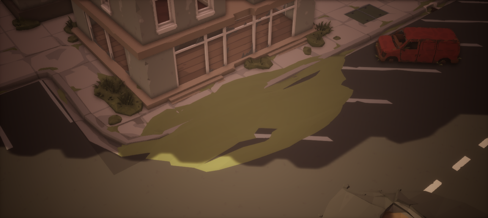
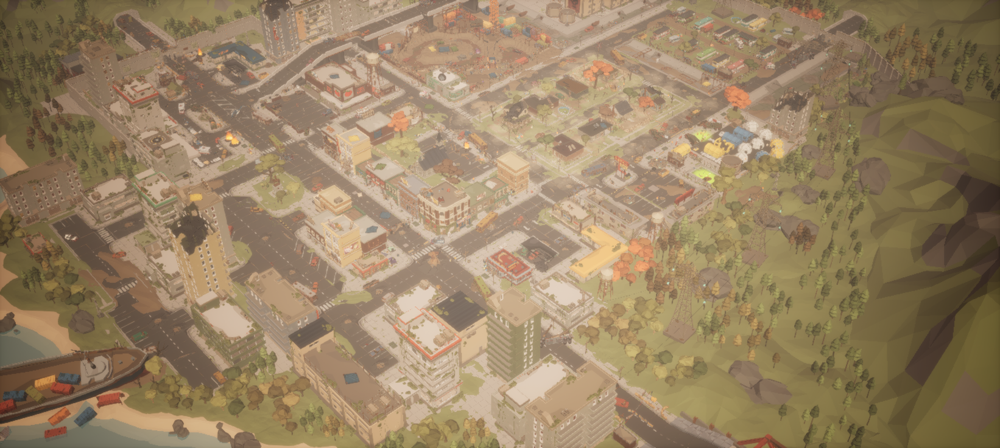
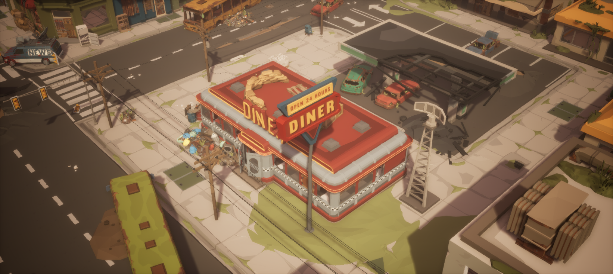
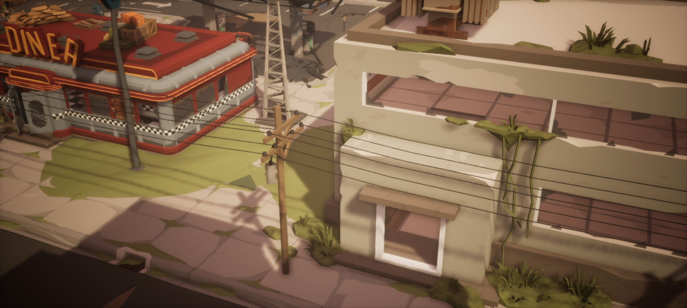
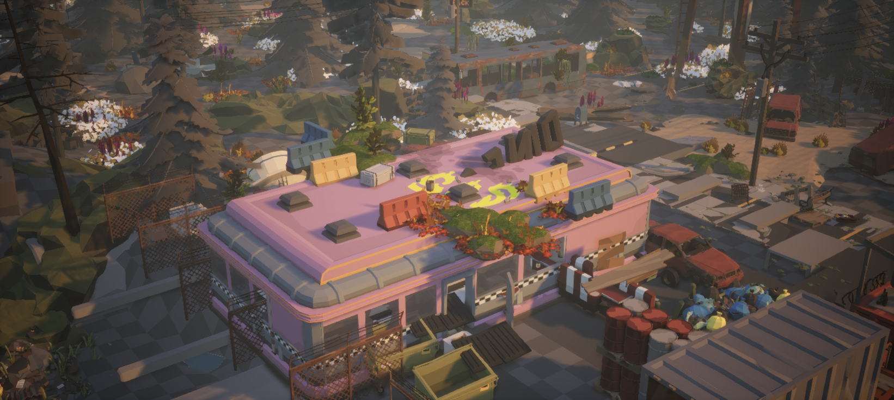

# 源地图研究：道路旁的草地不只有 Landscape

记录日期：2026-09-15。用户指出当前小城的道路与草地仍有生硬接缝，本轮停止搭建，返回 Apocalypse 与 Woodland 示例地图做只读研究。本文记录已解析节点和材质图的证据，不把此前的实例一致性或路线检查当成道路草地过渡的美术验收。

精简、可核对的记录见 [SourceMapStudy.json](../Data/SourceMapStudy.json)：包括节点计数、选定局部模型、截面样本、Landscape 绘制权重和观察机位。完整源节点及几何导出仍留在本地。

## Woodland 的地面由多种对象共同组成

**Woodland 不是只有 Landscape。** 已读取的源地图包含 Landscape Actor，也包含独立草模型、地被模型、土块、坡面和道路模型。下面按组件实际引用的网格统计，而不是按 Outliner 中的 Actor 标签猜测：同样叫 `SM_Env_Grass_01` 的 Actor，实际可以引用另一个 Alpine 草模型。

本地 `SourceWoodlandNodes.json` 保存了 5,412 个可解析网格实例。以下是其中几类明确存在的模型；这些数量是本次已解析记录的统计，不保证覆盖缺失组件、尚未解析的 Blueprint、运行时生成对象或所有植被实例。

| 模型名称 | 已解析实例数 | 所在资源目录 |
| --- | ---: | --- |
| `SM_Env_Grass_01` | 200 | Alpine：`/Game/Synty/PolygonNatureBiomes/PNB_Alpine_Mountain/Models/Environment` |
| `SM_Env_Grass_Alpine_01` | 90 | Woodland：`/Game/Synty/PolygonMapsWoodlandApocalypse/Models` |
| `SM_Env_Grass_Alpine_02` | 105 | Woodland，同上 |
| `SM_Env_Grass_Alpine_03` | 49 | Woodland，同上 |
| `SM_Env_Grass_Alpine_04` | 50 | Woodland，同上 |
| `SM_Env_GroundCover_01` | 45 | Alpine 的 `Models/Environment` |
| `SM_Env_GroundCover_02` | 62 | Alpine 的 `Models/Environment` |
| `SM_Env_GroundCover_03` | 227 | Alpine 的 `Models/Environment` |
| `SM_Gen_Env_Ground_Dirt_03` | 128 | `/Game/Synty/PolygonGeneric/Meshes/Environment` |

四种 Woodland Alpine 草共 294 个已解析实例，三种 GroundCover 共 334 个。这些草与地被记录的 Actor 类型为 `StaticMeshActor`，并带有实际模型、位置、旋转、缩放和材质引用，足以排除“画面中的草全部只是 Landscape 材质”的判断。其余已解析对象中还包括 `Ground_Dirt_01/04`、`Ground_Slope_Dirt_02`、多种 `Dirt_Cliff` 和落叶模型。

实例材质也需要分别读取。例如，所查 `Grass_Alpine_01` 样本使用 Alpine 草材质，而 `Grass_Alpine_02/03/04` 样本使用 Woodland 的 `MI_Grass_01`。因此不能只根据模型名称统一赋予同一种绿色材质，也不能把模型枢轴高度理解为普遍的离地距离。

这些节点证明了源图采用多种地面对象，尚不能证明每一处道路边缘的具体拼法。草丛和局部土块可以补充立体轮廓与局部形状；**它们不是大范围 Landscape 的通用替代品**。怎样承担连续地表、怎样接道路、哪些地方是模型覆盖，仍需逐区域测量。

## Landscape 材质图配置了什么

本轮通过 `LandscapeActor.get_actor_bounds` 读取到 Landscape 的平面包围范围约 **500×500 米**，并确认使用 `/Game/Synty/PolygonGeneric/LandscapeMaterial/M_Land_Woods`。本地 `LandscapeGraphStudy.json` 对该材质图做了只读记录：一个 `LandscapeLayerBlend` 节点包含 **22 层**：

- `Base` 使用 `LB_ALPHA_BLEND`。
- 其余 **21 层**使用 `LB_HEIGHT_BLEND`，名称为 `Dirt`、`Grass_01/02`、`Ice_02/03`、`Lake`、`Moss_Terrain_01/02/03`、`Mud`、`Pine_Dirt`、`Pine_Grass`、`Pine_Moss_01/02/03`、`River_Rock_01/02/03/04`、`Snow`、`Snow_Cliff`。

图中还有 Landscape 可见性遮罩和多个地表材质函数。**配置了 22 层，不表示当前地图每处都绘制了 22 层，也不表示这些层都参与当前可见区域。**

随后通过 `LandscapeComponent.editor_get_paint_layer_weight_by_name_at_location` 读取了 **12 个位置的实际绘制权重**，记录在本地 `WoodlandPaintLayerSamples.json`。其中三个样本如下，XY 为源地图世界坐标，单位厘米：

| 样本 XY | 读到的权重 |
| --- | --- |
| `(2500, 500)` | `Dirt=0.64823`，`Grass_02=0.35177` |
| `(0, 4000)` | `Grass_02=1.0` |
| `(-7000, 2000)` | `Grass_01=0.78455`，`Grass_02=0.21545` |

这说明源 Landscape **实际绘制了泥土、草地及它们的混合**，不只是材质图中存在这些名称。权重是选定位置的绘制数据，不等于最终着色，也不代表整张地图的覆盖率；12 个点不足以还原所有道路边缘的绘制形状，更不能在纹理缺失时据此宣称原效果已经恢复。

## 当前源图显示有依赖缺口

本轮 UE 观察中，Woodland 的 Landscape 材质编译失败，地表显示为棋盘格。本地依赖审计记录了 **24 个缺失纹理包引用**；审计范围是已解压资源目录，并非对所有压缩包或其他位置的完整搜索。

已检查的材质与材质函数文件和下载来源字节一致，但这不代表它们引用的纹理已齐全。现有审计没有建立能证明资产身份一致的路径别名方案；名称相似的纹理不能当作原纹理替换。因此，**当前本地画面没有还原 Woodland 原有的 Landscape 材质效果**，棋盘格也不能作为原作者地表颜色、混合或过渡品质的证据。

缺失引用、候选文件及完整依赖审计留在本地。本文只保留结论，不收入私有目录、完整扫描清单或源资产；本轮没有以替换纹理、改材质或增加模型来冒充原效果还原。

## Apocalypse 停车区：土块断续露出路面

本轮另读取了 Apocalypse 原 Demo 停车前场的一组实际节点，并将源实例变换应用到 LOD0 三角形后求截面高度。选定组合包括：

| 模型 | 世界位置 XYZ（cm） | 旋转与缩放 |
| --- | --- | --- |
| `SM_Env_Road_Parking_01` | `(5100, 5500, 0)` | Yaw=0°，Scale=(1,1,1) |
| `SM_Env_Sidewalk_Straight_01` | `(5100, 5000, 0)` | Yaw=180°，Scale=(1,1,1) |
| `SM_Generic_Ground_02` | 约 `(5040, 5446, -43)` | Yaw≈7.72°，另有微小 Pitch/Roll；Scale≈(0.77895,2.27906,1.34728) |

土块实际变换后的平面范围约 **9.27×23.73 米**，沿前场拉长并部分埋入。在源坐标 **Y=5250 cm** 的同一条截线上，它并非一直高于路面：X=4750 cm 处土面约 Z=5.30 cm，X=4850 cm 处约 Z=-2.65 cm，X=5100 cm 处又达到约 Z=25.53 cm；对应停车路面为 Z=0。再向人行道一侧，土面逐渐低于铺装而被遮住。

这组几何的结果是草土地块在道路与铺装中**断续露出、相互遮挡**，形成不规则边缘。它证明了这个局部采用部分埋入和有厚度模型的穿插，不能解释成一条等高、无台阶的窄路肩，也不能直接当作全城可通行的地面拼接配方。截面测量与画面观察需一起使用：材质颜色、露出的轮廓和角色碰撞仍是不同问题。

该观察机位采用位置 `(3600,4100,1600)` cm，朝向 `(5100,5300,0)` cm，FOV=58°，用于回到同一局部核对上述节点与截面。

## 道路与草地过渡的可复用检查顺序

1. **选定原图的一段道路边缘。** 同时记录路面、路缘、外侧地表和附近草、土、贴花的对象，保留可回到同一位置的观察信息。
2. **读取 Actor、组件和实例。** 记录实际 mesh path、父节点、局部/世界变换和实例材质；对于实例化组件逐实例展开，不能只数 Actor，也不能默认所有植被都在 Foliage 或 Landscape 中。
3. **区分连续地表和附加物。** 确认该处外侧地面由 Landscape、模块或局部土块提供，再判断草丛、地被与贴花覆盖了哪些位置。薄材质变化与有厚度模型要分别检查。
4. **检查 Landscape 的实际状态。** 材质图说明可用层和混合方式；实际权重、绘制范围和缺失依赖需要另查。材质编译失败时先记录限制，不能仅凭截图推断原有混合。
5. **测道路边界与地表接触。** 使用真实枢轴、旋转、LOD0 表面或 Landscape 高度，沿接缝取多个位置；区分几何高差、模型穿插、材质边界和植被遮挡。相同 Actor Z 或包围盒接触不足以证明连续。
6. **最后用近景和远景复核。** 截图验证轮廓、颜色、重复感和遮挡；它补充节点与几何证据，不能代替这些读取。确认原样板后，再决定是否适用于本课街区。

本轮完成了模型节点统计、Landscape 范围与材质图读取、12 个位置的绘制权重采样、依赖缺口确认，以及 Apocalypse 停车前场的局部节点和截面测量。这些是选定区域的证据，尚不构成全图权重、全部接口或当前自建小城的过渡验收；本文不预填修复方案或通过结论。

## 源图观察记录

下列 Apocalypse 截图用于定位原场景区域；模型搭配解释仍以节点和测量结果为准。

Woodland 图中可见屋顶地被模型，但本次加载也存在粉色建筑、白色植被和棋盘格地表等依赖缺失表现。该图只用于结构定位，不能作为原包正常材质、配色或最终氛围的还原证据。
