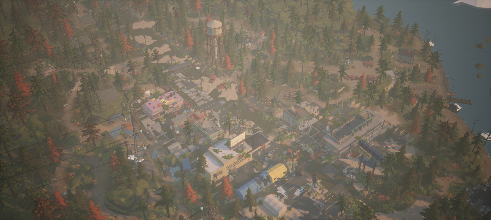
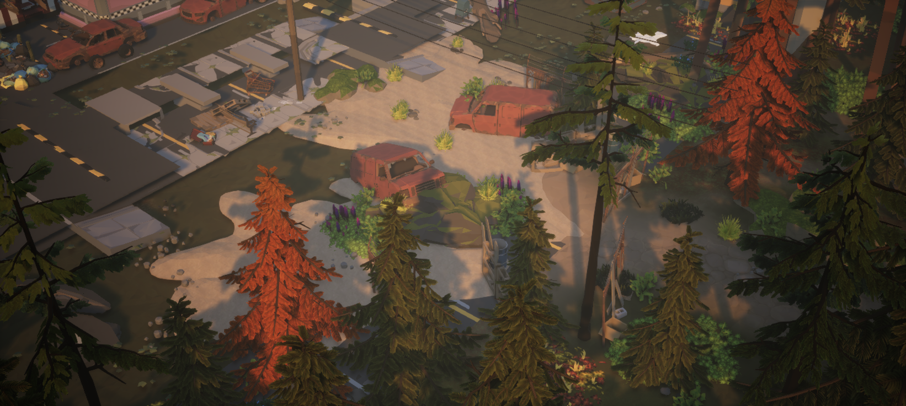
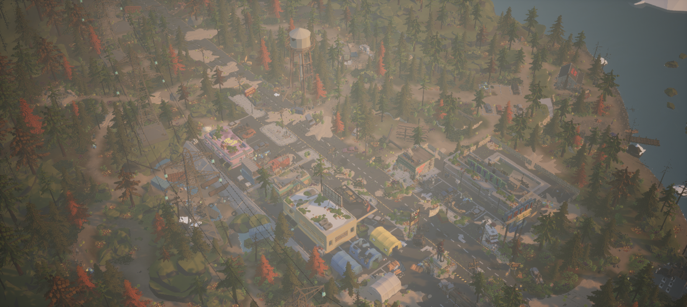
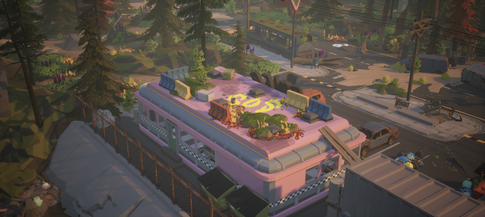
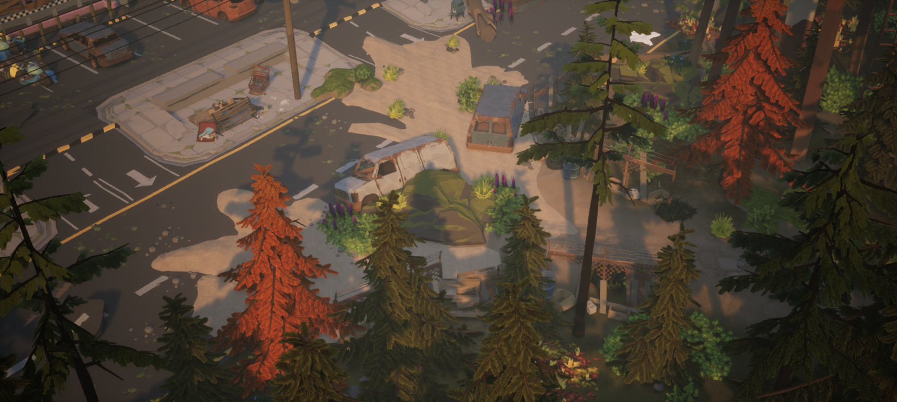

# 源地图研究：道路旁的草地不只有 Landscape

依赖全部恢复后的继续研究见 [从完整 Woodland 节点重新学习末日地面](ChaoticGroundStudy.md)：三个局部组合、45 个精选模型节点、196 个采样位置，以及完整／分层原图截图。本文下方保留较早研究和依赖更新过程，不能将早期缺失状态当作当前状态。

记录日期：2026-09-15。用户指出当前小城的道路与草地仍有生硬接缝，本轮停止搭建，返回 Apocalypse 与 Woodland 示例地图做只读研究。本文记录已解析节点和材质图的证据，不把此前的实例一致性或路线检查当成道路草地过渡的美术验收。

精简、可核对的记录见 [SourceMapStudy.json](../Data/SourceMapStudy.json)：包括节点计数、选定局部模型、截面样本、Landscape 绘制权重和观察机位。完整源节点及几何导出仍留在本地。

## Woodland 的地面由多种对象共同组成

**Woodland 不是只有 Landscape。** 已读取的源地图包含 Landscape Actor，也包含独立草模型、地被模型、土块、坡面和道路模型。下面按组件实际引用的网格统计，而不是按 Outliner 中的 Actor 标签猜测：同样叫 `SM_Env_Grass_01` 的 Actor，实际可以引用另一个 Alpine 草模型。

本地 `SourceWoodlandNodes.json` 保存了 5,412 个可解析网格实例。以下是其中几类明确存在的模型；这些数量来自依赖升级前的已解析记录，不作为升级后的重新统计，也不保证覆盖缺失组件、尚未解析的 Blueprint、运行时生成对象或所有植被实例。

| 模型名称 | 已解析实例数 | 所在资源目录 |
| --- | ---: | --- |
| `SM_Env_Grass_01` | 200 | Alpine：`/Game/Synty/PolygonNatureBiomes/PNB_Alpine_Mountain/Models/Environment` |
| `SM_Env_Grass_Alpine_01` | 90 | Woodland：`/Game/Synty/PolygonMapsWoodlandApocalypse/Models` |
| `SM_Env_Grass_Alpine_02` | 105 | Woodland，同上 |
| `SM_Env_Grass_Alpine_03` | 49 | Woodland，同上 |
| `SM_Env_Grass_Alpine_04` | 50 | Woodland，同上 |
| `SM_Env_GroundCover_01` | 45 | Alpine 的 `Models/Environment` |
| `SM_Env_GroundCover_02` | 62 | Alpine 的 `Models/Environment` |
| `SM_Env_GroundCover_03` | 227 | Alpine 的 `Models/Environment` |
| `SM_Gen_Env_Ground_Dirt_03` | 128 | `/Game/Synty/PolygonGeneric/Meshes/Environment` |

四种 Woodland Alpine 草共 294 个已解析实例，三种 GroundCover 共 334 个。这些草与地被记录的 Actor 类型为 `StaticMeshActor`，并带有实际模型、位置、旋转、缩放和材质引用，足以排除“画面中的草全部只是 Landscape 材质”的判断。其余已解析对象中还包括 `Ground_Dirt_01/04`、`Ground_Slope_Dirt_02`、多种 `Dirt_Cliff` 和落叶模型。

实例材质也需要分别读取。例如，所查 `Grass_Alpine_01` 样本使用 Alpine 草材质，而 `Grass_Alpine_02/03/04` 样本使用 Woodland 的 `MI_Grass_01`。因此不能只根据模型名称统一赋予同一种绿色材质，也不能把模型枢轴高度理解为普遍的离地距离。

这些节点证明了源图采用多种地面对象，尚不能证明每一处道路边缘的具体拼法。草丛和局部土块可以补充立体轮廓与局部形状；**它们不是大范围 Landscape 的通用替代品**。怎样承担连续地表、怎样接道路、哪些地方是模型覆盖，仍需逐区域测量。

## Landscape 材质图配置了什么

本轮通过 `LandscapeActor.get_actor_bounds` 读取到 Landscape 的平面包围范围约 **500×500 米**，并确认使用 `/Game/Synty/PolygonGeneric/LandscapeMaterial/M_Land_Woods`。本地 `LandscapeGraphStudy.json` 对该材质图做了只读记录：一个 `LandscapeLayerBlend` 节点包含 **22 层**：

- `Base` 使用 `LB_ALPHA_BLEND`。
- 其余 **21 层**使用 `LB_HEIGHT_BLEND`，名称为 `Dirt`、`Grass_01/02`、`Ice_02/03`、`Lake`、`Moss_Terrain_01/02/03`、`Mud`、`Pine_Dirt`、`Pine_Grass`、`Pine_Moss_01/02/03`、`River_Rock_01/02/03/04`、`Snow`、`Snow_Cliff`。

图中还有 Landscape 可见性遮罩和多个地表材质函数。**配置了 22 层，不表示当前地图每处都绘制了 22 层，也不表示这些层都参与当前可见区域。**

随后通过 `LandscapeComponent.editor_get_paint_layer_weight_by_name_at_location` 读取了 **12 个位置的实际绘制权重**，记录在本地 `WoodlandPaintLayerSamples.json`。其中三个样本如下，XY 为源地图世界坐标，单位厘米：

| 样本 XY | 读到的权重 |
| --- | --- |
| `(2500, 500)` | `Dirt=0.64823`，`Grass_02=0.35177` |
| `(0, 4000)` | `Grass_02=1.0` |
| `(-7000, 2000)` | `Grass_01=0.78455`，`Grass_02=0.21545` |

这说明源 Landscape **实际绘制了泥土、草地及它们的混合**，不只是材质图中存在这些名称。权重是选定位置的绘制数据，不等于最终着色，也不代表整张地图的覆盖率；12 个点不足以还原所有道路边缘的绘制形状，更不能在纹理缺失时据此宣称原效果已经恢复。

## 2026-09-15 升级前：源图显示有依赖缺口

当时的 UE 观察中，Woodland 的 Landscape 材质编译失败，地表显示为棋盘格。本地依赖审计记录了 **24 个缺失纹理包引用**；审计范围是当时已解压的资源目录，并非对所有压缩包或其他位置的完整搜索。

当时已检查的材质与材质函数文件和下载来源字节一致，但它们引用的纹理并未齐全。该次审计没有建立能证明资产身份一致的路径别名方案；名称相似的纹理不能当作原纹理替换。因此，**升级前的本地画面没有还原 Woodland 原有的 Landscape 材质效果**，棋盘格也不能作为原作者地表颜色、混合或过渡品质的证据。

缺失引用、候选文件及完整依赖审计留在本地。本文只保留结论，不收入私有目录、完整扫描清单或源资产；上述历史记录与截图保留，不用后续导入结果改写当时的缺失状态。

## 2026-09-15 Alpine 1.1.0 依赖更新

用户随后提供 `POLYGON_NatureBiomes_AlpineMountain_Unreal_5_3_v1_1_0`，为 Unreal 5.3 格式。Woodland 官方商品页明确要求 Apocalypse 和 Alpine 两套基础包；Alpine 官方更新记录也注明 **Unreal 1.1.0 升级到 UE 5.3**。这两点说明应核对基础包的具体引擎版本与引用目录，而不能把地图包视为包含全部依赖的独立资源。[Woodland 官方依赖说明](https://syntystore.com/products/polygon-woodland-apocalypse-map)、[Alpine 官方更新记录](https://syntystore.com/en-gb/products/polygon-alpine-mountain-nature-biomes)。

新压缩包已按完整资源路径检查；导入后，此前缺失的 **24 / 24 个 Landscape 纹理引用均在工程精确路径存在，且逐字节匹配新包**。文件存在、材质编译与实际显示分别检查，执行摘要见 [Alpine110Upgrade.json](../Data/Alpine110Upgrade.json)。

本次导入完成，结果为 `imported_and_hash_verified`。按目标路径和内容比较后的实际处理如下：

| 类别 | 数量 | 处理方式 |
| --- | ---: | --- |
| 目标缺失的新文件 | 435 | 已按新包原路径导入并核对哈希 |
| 内容不同的旧 Alpine / PNB_Core 文件 | 97 | 原文件已备份并验证备份哈希，再按更新清单替换 |
| 内容相同的既有文件 | 1,156 | 保持不动 |
| PolygonGeneric 共享目录冲突 | 22 | 保留 Woodland 原有版本，没有用新 Alpine 的同路径文件覆盖 |

保留共享目录冲突的依据是避免在补充 Alpine 依赖时改变 Woodland 原地形材质及其共享资源。本次采用新包的精确引用路径；升级前从旧 Alpine 建立的少量路径别名、历史布局和复现验证仍各自保留，不能自动作为新版依赖已兼容的证明。

原 Woodland 与自建学习目录中列入保护检查的 **124 个文件哈希均未变化**。这项结果针对记录中的受保护文件，不扩写为工程所有文件的完整性证明。

UE **5.8.2** 重新启动并加载 Woodland 原地图后，取得以下结果：

| 检查 | 升级后实际结果 |
| --- | --- |
| 地图对象读取 | 5,697 个 Actor、5,412 个有效静态网格组件、209 个空静态网格组件；这些数量与升级前相同 |
| 本次启动日志 | `Failed to compile` 和 `Missing input texture` 均为 0 条；不等于所有类型的日志问题都已排除 |
| `M_Land_Woods` 材质统计 | `get_statistics` 返回有效统计，vertex=140、pixel=245；该统计不作为帧率或目标硬件性能证明 |
| 源地图画面 | Landscape 棋盘格消失，草土材质恢复显示，部分树叶着色有所改善 |
| 自建小城重开检查 | `verify_town.py` 核对 5,053 个模型实例、184 个贴花、11 个相机，0 个错误 |

**Alpine 阶段确认修复了这组 Landscape 纹理缺口及棋盘格问题，当时尚未证明完整原图已还原。** 该阶段仍有 209 个空网格组件，餐厅的粉色材质也尚未核实。后续 Apocalypse 更新对两项问题分别作了检查，结果见下一节。自建小城在 Alpine 阶段的通过结果只说明当时重开后的实例与引用和配方一致，不是对更新模型的几何、碰撞、导航或性能重新验收。旧截图、旧依赖清单和历史验证记录保留，用于区分各次环境状态。

## 2026-09-15 Apocalypse 1.21.1 依赖更新

Alpine 阶段恢复了 Landscape 的草土地表，但当时 Woodland 仍有 209 个空静态网格组件，部分建筑颜色也未确认。用户随后提供 `POLYGON_Apocalypse_Unreal_5_3_v1_21_1`，继续补充 Woodland 所引用的 Apocalypse 资源。这里单独记录这次更新，保留上一阶段的计数与截图作为历史。

更新前通过 AssetRegistry 读取 Woodland 原图的直接包依赖，并按精确文件路径检查，得到 **141 条尚缺的包引用**，全部位于 `/Game/Synty/PolygonApocalypse`。这份直接依赖清单与 209 个空组件是不同统计：同一资产可能用于多个组件，空组件记录也不一定含有可用资产路径，不能直接把两个数量相减来推算修复效果。

新包对上述缺失引用的精确路径覆盖为 **141 / 141**；更新后，141 条路径均已落盘，并逐文件核对哈希与新包一致。此次操作仅更新选定资源文件，没有把压缩包附带的工程配置当作当前工程配置替换。实际文件处理如下：

| 类别 | 数量 | 实际处理 |
| --- | ---: | --- |
| 目标缺失的新文件 | 1,364 | 按新包原路径加入，并核对哈希 |
| 内容不同的目标文件 | 2,213 | 先备份并验证备份，再按更新清单替换 |
| 内容相同的既有文件 | 1,131 | 保持不动 |
| PolygonGeneric 共享目录冲突 | 65 | 保留当前工程中的文件，没有随此次更新覆盖 |

65 个共享冲突包括 58 个贴花材质实例、5 个 FX 网格及 2 张 Generic 地图。新包不含 `LandscapeMaterial`、Alpine 或 Woodland 目录；保留冲突文件进一步限制了共享资源变动。更新前后的保护检查覆盖 **3,382 个文件**，包括旧 `/Game/PolygonApocalypse` 资源、自建学习目录、Woodland、已更新的 Alpine 和地形材质，所查文件哈希全部未变。这是指定保护清单的结果，不等于对未列入清单的整个工程作出完整性保证。

UE **5.8.2** 重启并打开 Woodland 原图后完成了只读检查，原先的 **209 个空静态网格组件已全部恢复**，已检查的直接与递归资源引用均不再缺失。公开执行摘要见 [Apocalypse1211Upgrade.json](../Data/Apocalypse1211Upgrade.json)。

| 检查 | Apocalypse 1.21.1 更新后实际结果 |
| --- | --- |
| 地图对象读取 | 5,697 个 Actor、5,621 个有效静态网格组件、677 种模型；空静态网格组件为 0 |
| 静态网格材质槽 | 缺失材质槽为 0 |
| 贴花组件 | 检查 51 个 DecalComponent，缺失材质为 0 |
| 原图直接资源依赖 | 791 条直接 `/Game` 包依赖，缺失为 0 |
| 递归资源依赖 | 遍历 1,083 个 `/Game` 包，缺失为 0 |
| 原 141 条缺失引用加载 | 全部成功：130 个 StaticMesh、10 个 MaterialInstanceConstant、1 个 NiagaraSystem |
| 本次启动日志 | `Failed to compile` 与 `Missing input texture` 均为 0 条 |
| 自建小城重开复核 | 本次更新后重新打开小城，`verify_town.py` 核对 5,053 个模型实例、184 个贴花、11 个相机，0 个错误 |
| 重开后的保护检查 | 3,382 个受保护文件再次核对哈希，仍全部未变 |
| 检查结束的编辑器状态 | 地图与内容包均无未保存改动；没有为画面检查保存源地图改动 |

餐厅在更新后仍为粉色，这次进一步读取了材质来源：模型默认使用 `MI_PolygonApocalypse_01_A`，但原地图中的该 Actor 明确覆盖为 **`MI_PolygonApocalypse_04_B`**。因此不能把粉色本身当作缺失材质的错误信号，也不应为了消除粉色而手工换掉原图选用的材质。本次保留该覆盖关系；源地图由保护哈希核对，更新资源与新包哈希匹配。

这些检查解决了本次记录的缺失组件与资源引用问题，截图展示的是更新后实际打开的原图。它们不能保证不同引擎版本下光照、曝光和所有渲染细节完全一致，也不构成碰撞、导航、性能或商业游戏验收。自建小城的本次重开复核已经完成；其 0 错误结果针对实例标识、引用、变换、标签、碰撞配置、贴花范围和相机等已登记属性，不是道路与草地接触几何或美术过渡的重新验收。复核后再次打开 Woodland 原图，地图与内容包均无未保存改动。

本次资源更新没有改写第五课旧的 `Dependencies.json`、构建脚本约定和历史复现哈希。旧配置使用的 `/Game/PolygonApocalypse` 与本次 Woodland 依赖的 `/Game/Synty/PolygonApocalypse` 是不同挂载路径；旧脚本的验证结果不能自动证明新版原图可由旧配置复现。

## Apocalypse 停车区：土块断续露出路面

本轮另读取了 Apocalypse 原 Demo 停车前场的一组实际节点，并将源实例变换应用到 LOD0 三角形后求截面高度。选定组合包括：

| 模型 | 世界位置 XYZ（cm） | 旋转与缩放 |
| --- | --- | --- |
| `SM_Env_Road_Parking_01` | `(5100, 5500, 0)` | Yaw=0°，Scale=(1,1,1) |
| `SM_Env_Sidewalk_Straight_01` | `(5100, 5000, 0)` | Yaw=180°，Scale=(1,1,1) |
| `SM_Generic_Ground_02` | 约 `(5040, 5446, -43)` | Yaw≈7.72°，另有微小 Pitch/Roll；Scale≈(0.77895,2.27906,1.34728) |

土块实际变换后的平面范围约 **9.27×23.73 米**，沿前场拉长并部分埋入。在源坐标 **Y=5250 cm** 的同一条截线上，它并非一直高于路面：X=4750 cm 处土面约 Z=5.30 cm，X=4850 cm 处约 Z=-2.65 cm，X=5100 cm 处又达到约 Z=25.53 cm；对应停车路面为 Z=0。再向人行道一侧，土面逐渐低于铺装而被遮住。

这组几何的结果是草土地块在道路与铺装中**断续露出、相互遮挡**，形成不规则边缘。它证明了这个局部采用部分埋入和有厚度模型的穿插，不能解释成一条等高、无台阶的窄路肩，也不能直接当作全城可通行的地面拼接配方。截面测量与画面观察需一起使用：材质颜色、露出的轮廓和角色碰撞仍是不同问题。

该观察机位采用位置 `(3600,4100,1600)` cm，朝向 `(5100,5300,0)` cm，FOV=58°，用于回到同一局部核对上述节点与截面。

## 道路与草地过渡的可复用检查顺序

1. **选定原图的一段道路边缘。** 同时记录路面、路缘、外侧地表和附近草、土、贴花的对象，保留可回到同一位置的观察信息。
2. **读取 Actor、组件和实例。** 记录实际 mesh path、父节点、局部/世界变换和实例材质；对于实例化组件逐实例展开，不能只数 Actor，也不能默认所有植被都在 Foliage 或 Landscape 中。
3. **区分连续地表和附加物。** 确认该处外侧地面由 Landscape、模块或局部土块提供，再判断草丛、地被与贴花覆盖了哪些位置。薄材质变化与有厚度模型要分别检查。
4. **检查 Landscape 的实际状态。** 材质图说明可用层和混合方式；实际权重、绘制范围和缺失依赖需要另查。材质编译失败时先记录限制，不能仅凭截图推断原有混合。
5. **测道路边界与地表接触。** 使用真实枢轴、旋转、LOD0 表面或 Landscape 高度，沿接缝取多个位置；区分几何高差、模型穿插、材质边界和植被遮挡。相同 Actor Z 或包围盒接触不足以证明连续。
6. **最后用近景和远景复核。** 截图验证轮廓、颜色、重复感和遮挡；它补充节点与几何证据，不能代替这些读取。确认原样板后，再决定是否适用于本课街区。

本轮完成了模型节点统计、Landscape 范围与材质图读取、12 个位置的绘制权重采样、依赖缺口确认，以及 Apocalypse 停车前场的局部节点和截面测量。这些是选定区域的证据，尚不构成全图权重、全部接口或当前自建小城的过渡验收；本文不预填修复方案或通过结论。

## 源图观察记录

下列 Apocalypse 截图用于定位原场景区域；模型搭配解释仍以节点和测量结果为准。

这张 Woodland 历史图拍摄于 Alpine 1.1.0 更新前，可见屋顶地被模型，也存在白色植被和棋盘格地表等依赖缺口表现。图中的粉色餐厅后来已核实为原地图 Actor 的材质覆盖，不能仅凭颜色把它归为缺失材质。该历史图只用于结构定位，不能作为升级后状态或原包正常材质与最终氛围的还原证据。
