# 第五课：从真实节点学习末日小城的区域搭建

本课将第三、四课的街区发展成一座有明确区域用途、废弃痕迹和自然侵入的小型城市。核心地面约 **200×160 米**，外围增加道路延伸、林缘和山体；主体包括 **13 栋建筑和 2 处加油棚，其中一处烧毁**。原有地面与建筑训练保留为参考，本课使用独立关卡：

`/Game/SyntySenceLearning/PolygonApocalypse/AftermathTown/L_AftermathTown`

目标是积累面向商业游戏美术制作的搭建方法。当前状态为 **reproduced-and-reloaded/art-study**：主关卡及从空图完整构建的 `ReproductionFinal` 副本均已保存重开，`verify_town.py` 核对零错误。当前仍是美术训练场景：画面中部分空地较大，街块和模块排列较规整，后续可继续深化建筑密度、区域层次与细节分布；尚不能称为发布就绪的商业游戏成品。

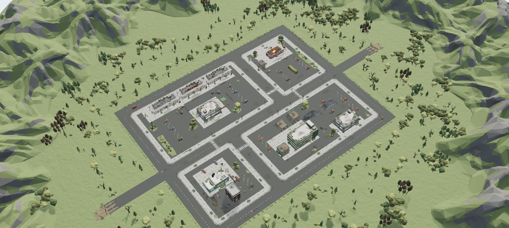

## 先读取节点，再判断画面

研究示例地图时，首先读取 Actor 和组件的模型引用、父子关系、局部与世界变换、材质覆盖和缺失引用；随后测量模型枢轴、包围盒及必要的 LOD0 表面高度。截图用于检查构图、遮挡、接地和远近景表现。仅看截图或模型名称，无法可靠判断附件是否共枢轴、植物是否埋入地面，以及同名模型能否互换。

| 读取对象 | 本地研究取得的证据 | 对本课的作用 |
| --- | --- | --- |
| Apocalypse 原 Demo | 7,218 个静态网格组件、951 种可解析模型的节点与包围盒 | 拆解车辆与蔓生附件、油棚、垃圾箱与盖、桶与篷布、围栏等局部组合 |
| Woodland 示例地图，依赖升级前 | 5,697 个 Actor、5,412 个可解析网格实例、547 种模型；另外记录 209 个缺失网格组件 | 研究林缘、地表旧化、区域之间的自然过渡，并识别当时的依赖缺口 |
| Woodland 饭店 Blueprint | 106 个节点，其中 99 个静态网格组件无缺失，另有 6 个贴花组件 | 读取屋顶植被和贴花相对建筑的位置；不能把所有节点直接视为当前版本可用的整套配方 |
| 同次读取的加油站、旅馆 Blueprint | 分别存在 16 个、9 个缺失网格组件 | 记录缺失依赖，避免在信息不完整时宣称已经完整复现 |

这些计数属于最初的源场景研究记录，与本课最终使用多少模型无关；其中的缺失状态不是依赖升级后的当前结果。完整源地图、Blueprint、节点导出和完整几何留在本地，不随本仓库发布。

2026-09-15 补充：[源地图研究：道路旁的草地不只有 Landscape](Notes/SourceMapStudy.md)。用户指出当前道路与草地接缝仍生硬，本轮停止搭建，重新读取源图草、地被和土块节点、约 500×500 米的 Landscape、22 层材质配置及 12 个位置的实际绘制权重。先更新用户提供的 Alpine 1.1.0，补齐 24 个 Landscape 纹理引用并恢复草土地表；随后更新 Apocalypse 1.21.1，补齐 141 条缺失直接包引用。两包均为 UE5.3 格式。

**当前 Woodland 原图中，原先 209 个空静态网格组件已全部恢复，所查资源引用不再缺失。** UE5.8.2 重启后读取到 5,621 个有效静态网格组件、677 种模型，网格和贴花材质缺失均为 0；791 条直接依赖与 1,083 个递归 `/Game` 包的检查也未发现缺失。餐厅的粉色已核实来自原地图 Actor 指定的 `MI_PolygonApocalypse_04_B` 材质覆盖，保留原图配色，不把粉色本身视为错误。详情与新截图见[更新记录](Notes/SourceMapStudy.md#2026-09-15-apocalypse-1211-依赖更新)和 [Apocalypse1211Upgrade.json](Data/Apocalypse1211Upgrade.json)；旧阶段的缺失计数与截图作为历史保留。这些结果不代表跨引擎渲染完全一致，也不等于自建小城的道路草地过渡已通过美术验收。

2026-09-15 依赖完整后继续研究：[从完整 Woodland 节点重新学习末日地面](Notes/ChaoticGroundStudy.md)。选择土层侵入道路、破损路面与沟槽、垃圾堆与植物三个局部，共 45 个模型节点；读取 26 个实例的当前 LOD0，并测量 196 个位置的 Landscape 高度参考与绘制权重。记录真实接缝、共变换及独立附件偏移，附完整／分层原图截图与只读复测脚本。本轮为源图学习，没有修改自建小城。

### 共枢轴必须由节点关系证实

饭店侧边的桶堆与篷布共享位置、旋转和缩放，原节点均为 Z=-5 cm，适合整体变换。垃圾箱的盖却有独立枢轴：本次样本中，盖相对箱体的世界位移约为 **(-109.56, -65.35, +180.88) cm**；箱外两层垃圾共享另一组变换。搬运组合时保留相对关系，不能把盖、布和垃圾逐件吸附到同一个地面高度。

车辆的蔓生附件也存在不同情况。部分开后备厢汽车与附件同枢轴；SUV 和厢式车的植物附件另有高度偏移，普通轿车还有平面偏移。组件的实例材质也可能覆盖模型默认材质。本课以读取到的具体样本为依据，不把某一种车的关系套用到整个系列。

### 同名资源也可能有版本和坐标轴差异

Woodland 饭店 Blueprint 引用的建筑版本，与当前 Apocalypse 包的主体轴向并不完全一致。按主体欧拉角直接推导出的转向，不能保证桌椅、招牌和屋顶植物落在正确位置。

本次用 **14 个已有桌椅标志点**比较候选映射，选择空间一致性更好的 `deltaYaw=0` 候选，并继续检查屋顶位置。最终只采用 **9 个屋顶植被节点和 4 个屋顶贴花**，其余室内贴花、主体、门和家具没有作为整套 Blueprint 重复加入。叶色调整通过本课派生材质完成。这个案例记录的是校准方法和有限应用，不是同名资源普遍兼容的证明。

## 用区域关系组织细节

小城沿用已有街块和前后场关系。加油站保留车辆进出与停靠空间；饭店有入口、露台和后院；旅馆包含接待、停车、废弃泳池及临时落脚痕迹；维修店用作业区、废车、工具与围栏表达用途。垃圾、纸张、油污、轮胎印和植被集中在有原因的位置，避免平均铺满所有空地。

内部自然侵入层设置了八个重点小区域：

| 小区域 | 地面与植物的关系 |
| --- | --- |
| 加油站后勤空隙 | 在围栏后保留积土、灌木和杂草，连接建筑后场 |
| 废弃前场花地 | 利用加油区与商铺之间的旧种植空间形成植物群 |
| 饭店后角 | 让墙脚、后院和自然地表相互衔接 |
| 咖啡店背侧 | 用较小植被群表现长期失管的角落 |
| 旅馆接待处残留绿地 | 留出入口识别和步行空间，植物集中在边缘 |
| 旅馆院落植被岛 | 形成院落内的视觉变化，避开主要车辆与设施 |
| 东侧停车尾部 | 在车位末端增加土、落叶和低矮植物 |
| 修车院旧花地 | 连接院地与围栏边缘，保留作业区和门前空间 |

这八处加上路缘与围栏边的小群，共构成 **456 个内部自然侵入实例、31 种模型**：8 个土地区块、14 棵树、48 组灌木、32 组蔓生、192 组草、40 组落叶及 122 组边缘草。它们是为本城重新安排的区域配方，不是整张源 Demo 的复制。

最后的区域细化保留上述 456 个实例，另在**饭店西侧停车边缘和旅馆东侧前场**加入两条连续植被带，共 **158 个新实例**：6 个土地区块、20 组灌木、24 组蔓生、84 组草和 24 组落叶。每处 79 个实例，将孤立的植物群连成沿停车区边缘分布的土与植被过渡，并保留车行入口；同时增加 12 个定向地表贴花。局部 LOD0 支撑、土带中心线与入口避让依据见 [PolishStudy.json](Data/PolishStudy.json)。这些检查用于约束布局，土块交叠与近景接地仍需结合实际 UE 画面判断。

植物枢轴的支撑高度取自既有地面和选定土地区块的 LOD0 三角形，再保留明确记录的埋入量。树根的本地包围盒低于零，不意味着应把整棵树抬高到最低点贴地；`Generic_Ground` 和 `Dirt_Flat` 也有厚度，不能当成无厚度贴花盖住路面。支撑点采样用于避免明显悬空，仍不等于所有顶点接触、碰撞或导航检查。

## 布局、依赖与复现

| 数据 | 当前登记内容 |
| --- | --- |
| [Layout.json](Data/Layout.json) | 5,053 个静态网格实例，214 种模型；包含核心地面、建筑和场景布置 |
| [Decals.json](Data/Decals.json) | 184 个贴花实例，独立记录尺寸、变换与材质 |
| [Cameras.json](Data/Cameras.json) | 11 个观察机位 |
| [Dependencies.json](Data/Dependencies.json) | 本地原包、资源挂载路径和兼容引用要求 |
| [ReproductionValidation.json](Data/ReproductionValidation.json) | 主图及独立完整复现副本保存重开后的实际验收记录 |
| [CollisionValidation.json](Data/CollisionValidation.json) | 地面射线、接缝偏移复查及选定路线的胶囊检查，包含未命中的原始结果 |
| [SourcePackageIntegrity.json](Data/SourcePackageIntegrity.json) | 307 个源文件与下载原包的哈希比对 |
| [Routes.json](Data/Routes.json) | 可重复执行的路线与车行入口碰撞采样定义 |
| [PolishStudy.json](Data/PolishStudy.json) | 两处连续植被带的局部几何、支撑与避让依据 |

此前完成的本课复现使用 UE **5.8.2**，依赖 Apocalypse **1.20.0**、Woodland **1.0.0** 随附的 PolygonGeneric，以及 Alpine 旧版 **1.0.1** 的 `Content/Biomes`。Apocalypse 保持 `/Game/PolygonApocalypse` 路径；其他挂载路径以依赖清单为准。这份历史清单的兼容处理涉及 **6 个模型、2 个材质和 3 个贴图的精确路径别名**，不能用模糊同名搜索随意替换，也不能用重命名原包资产解决引用问题。

2026-09-15 的源地图研究已更新用户提供的 **Alpine 1.1.0 / Unreal 5.3** 依赖：新增 435 个文件、备份并更新 97 个旧文件，1,156 个相同文件保持不动，22 个 PolygonGeneric 冲突保留 Woodland 原版本。列入保护检查的 124 个原 Woodland 与自建学习文件哈希未变；自建小城重开后 5,053 个模型实例、184 个贴花、11 个相机核对零错误。方法、升级后原图及限制见[源图研究笔记](Notes/SourceMapStudy.md#2026-09-15-alpine-110-依赖更新)和 [Alpine110Upgrade.json](Data/Alpine110Upgrade.json)。

用户随后提供 **Apocalypse 1.21.1 / Unreal 5.3**。更新前确认的 141 条 Woodland 缺失直接包引用，已全部按精确路径落盘并与新包哈希匹配；实际新增 1,364 个文件、备份后更新 2,213 个，1,131 个同内容文件不动，65 个共享 Generic 冲突保留。UE 重启后，141 项旧缺失资源全部加载成功，原图空静态网格组件清零，启动日志中 `Failed to compile` 和 `Missing input texture` 均为 0 条。自建小城也在这次更新后重新打开，`verify_town.py` 核对 5,053 个模型实例、184 个贴花、11 个相机，0 个错误；随后重开 Woodland，地图与内容包均无未保存改动，3,382 个受保护文件再次核对哈希仍全部未变。过程见[Apocalypse 1.21.1 更新记录](Notes/SourceMapStudy.md#2026-09-15-apocalypse-1211-依赖更新)。本次小城实例复核与原图依赖检查分别记录，不能据此宣称已重新验收道路草地的接触几何、碰撞、导航或美术过渡。

这两次更新不改写本课旧布局、依赖清单或历史复现哈希，也没有重新验收更新模型的几何、碰撞或性能。下面准备脚本的路径约定仍对应上述历史配置，不能把新版包直接当作旧版 `Content/Biomes` 目录替换后宣称已复现；也不能将旧 `/Game/PolygonApocalypse` 与新版 Woodland 依赖的 `/Game/Synty/PolygonApocalypse` 两个路径混用。

本课自带最终摆放配方，构建时不需要打开源 Demo 或先重建第三、四课。学习背景可参阅[第三课](../03-expanded-neighborhood/README.md)和[第四课](../04-building-placement/README.md)。原资源必须已在本地合法取得；仓库不包含源二进制资产。

1. 在目标 UE 工程启用 **Python Editor Script Plugin** 与 **Editor Scripting Utilities**。
2. 在仓库根目录准备本课文件：

```powershell
python tools/prepare_study.py --project "X:/YourProject/YourProject.uproject" --study aftermath-town
```

准备工具将文件放入工程 `Learning/SyntySenceLearning/polygon-apocalypse/05-aftermath-town`，并输出实际执行路径。

3. 按 `Data/Dependencies.json` 准备本地原包。下面在仓库根目录执行，把示例路径换为自己的工程及各资源包的 `Content` 目录；可先传入 `--help` 检查参数。依赖工具按文件哈希预检查，遇到目标文件内容不同会在复制前停止，保留已有修改；它不下载或授予原资源。

```powershell
python packs/polygon-apocalypse/studies/05-aftermath-town/Scripts/prepare_dependencies.py --project "X:/YourProject/YourProject.uproject" --apocalypse-content "X:/Assets/Apocalypse/Content" --woodland-content "X:/Assets/Woodland/Content" --alpine-content "X:/Assets/Alpine/Content"
```

4. 依赖复制后按工具提示刷新 UE 资产注册表，或重新打开工程，再在 UE 中按顺序执行：

| 顺序 | 脚本 | 用途 |
| --- | --- | --- |
| 1 | `Scripts/setup_materials.py` | 准备本课派生材质，保持源材质与贴图不变 |
| 2 | `Scripts/build_town.py` | 由最终配方创建独立关卡，放置模型、贴花和相机 |
| 3 | `Scripts/verify_town.py` | 只读核对实际关卡与布局，不在验收时自动修正 |
| 4 | 切换到另一张已保存地图，再重开本课地图 | 检查保存与加载后的持久化状态 |
| 5 | 再执行 `Scripts/verify_town.py` | 将保存重开后的实际结果作为复现证据 |
| 6 | `Scripts/check_routes.py` | 读取 `Data/Routes.json`，重跑简单/复杂地面射线、胶囊路线检查和接缝偏移复查 |
| 7 | `Scripts/set_view.py` | 查看总览及区域、接地与边界机位 |

上表五个脚本在 UE 编辑器的 Python 环境运行；文件准备与依赖复制工具在本机 Python 运行。已有 MCP 的工程可使用其 UE Python 执行入口。准备文件不等于已经构建关卡。构建前需保存当前地图和资源；`build_town.py` 拒绝覆盖已有目标地图，包括未完成的旧构建。较大构建可能超过一次 MCP 响应的等待时间，应先检查编辑器状态，避免立即重复执行。

`check_routes.py` 对当前本课关卡执行只读碰撞查询，不改变 Actor、碰撞设置或源资源。实际结果写入目标工程 `Saved/SyntySenceLearning/AftermathTown/CollisionRoutes.json` 与 `CollisionSeamProbes.json`，不会覆盖仓库中的历史证据。胶囊半径为 35 cm、半高 88 cm、中心 Z=100 cm，在已定义通道的三条采样轨迹及九个车行入口检查；该参数用于人形尺度空间采样，不等于车辆转弯或整个通道宽度均已可通行。

## 观察机位

| 相机 | 检查重点 |
| --- | --- |
| `01_Overview` | 街区密度、区域关系和外围自然边界 |
| `02_GasStation` | 完整与烧毁油棚、车辆和加油站前场 |
| `03_Diner` | 饭店入口、后院、屋顶植被与旧化 |
| `04_Motel` | 院落、停车、接待和东侧过渡 |
| `05_Repair` | 作业区、废车、围栏和门前空间 |
| `06_Shops` | 临街商铺、侧墙设施和后勤区域 |
| `07_GasConnection` | 加油区的地面与植物衔接 |
| `08_DinerConnection` | 饭店区域的近景接地与过渡 |
| `09_EastBoundary` | 道路出口、林缘和场景外侧关系 |
| `10_DinerReclamation` | 饭店西侧连续土带、停车边缘与植被接地 |
| `11_MotelReclamation` | 旅馆东侧连续植被带、前场及入口避让 |

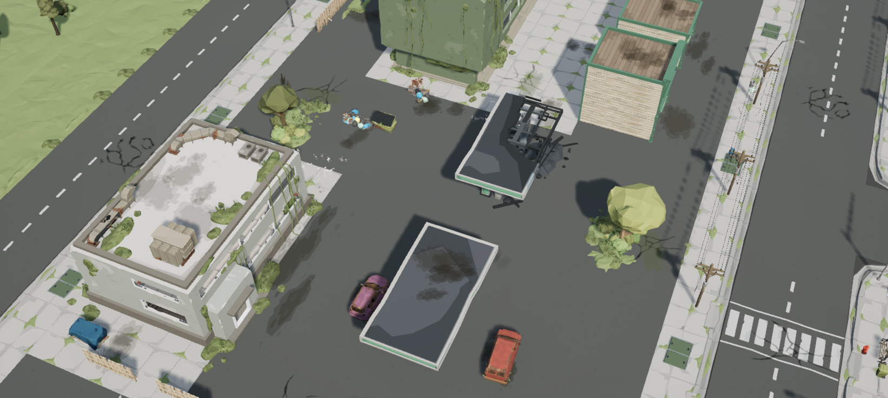
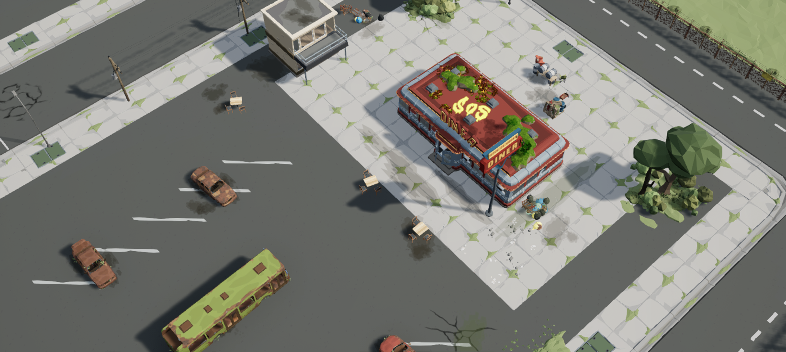
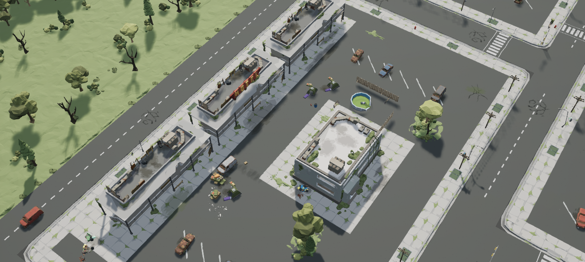
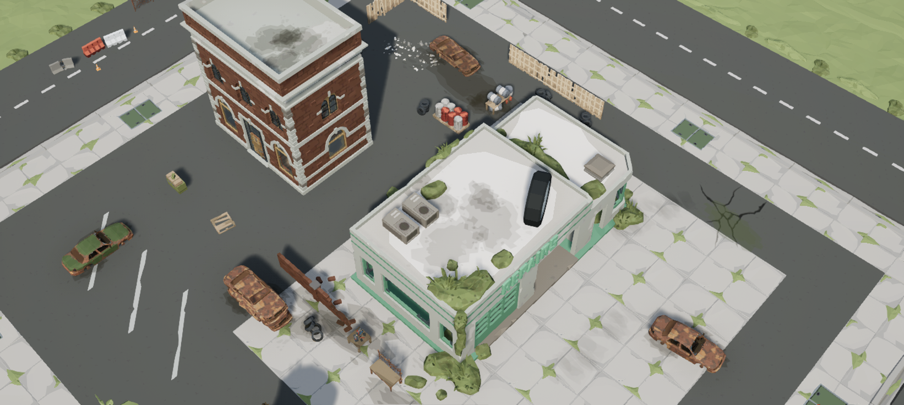
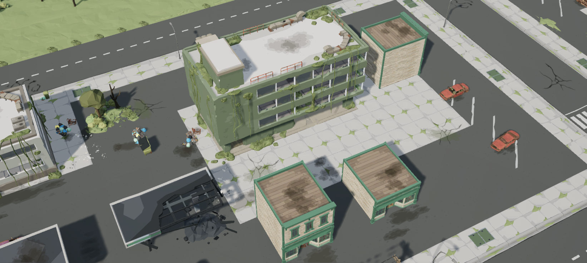
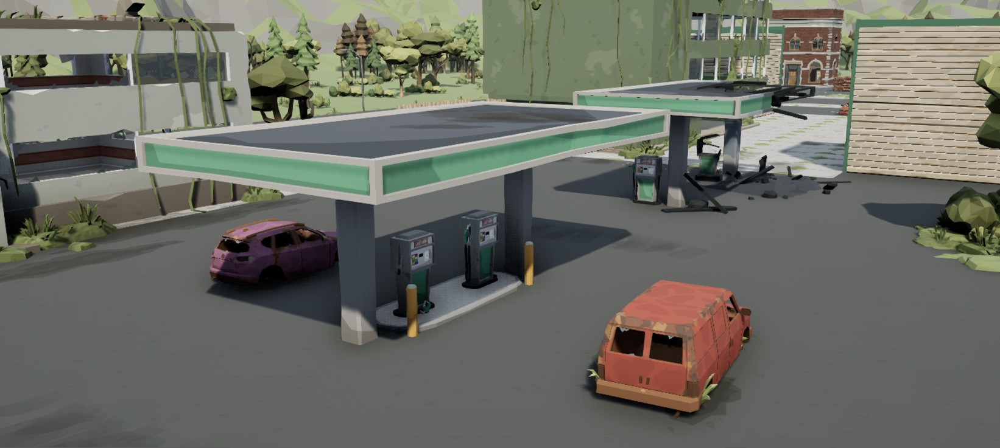
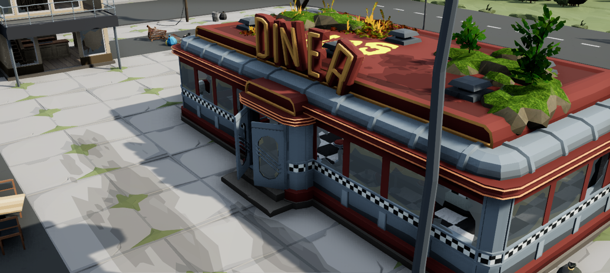
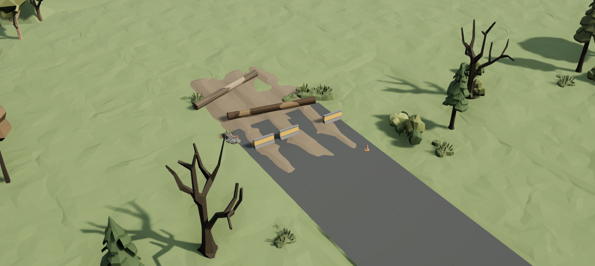
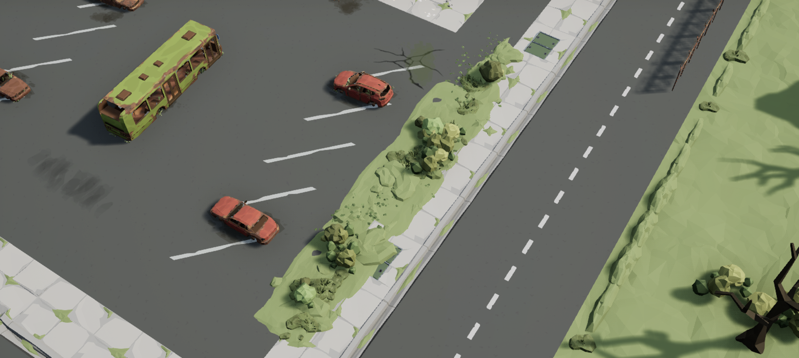
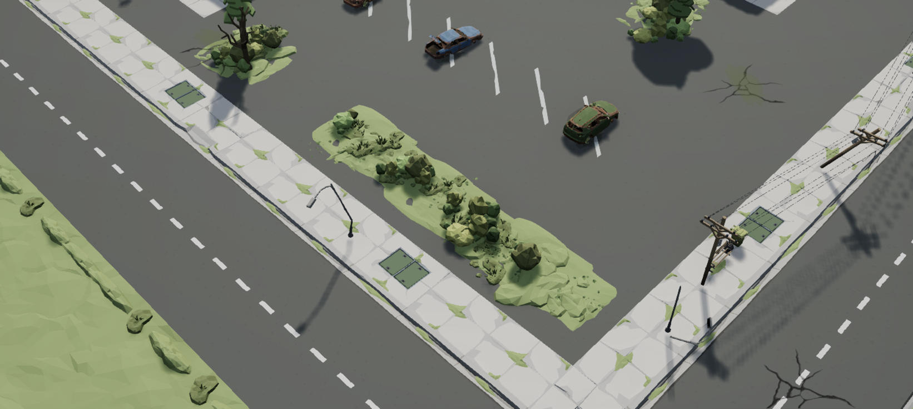

## 实际验证与边界

下表保留本课原配方构建、完整复现和路线采样阶段的结果。2026-09-15 两次依赖更新后的原图与小城复核分别记录在上文及对应升级证据中，没有改写这些历史测试。

| 检查 | 本次结果 |
| --- | --- |
| 主关卡保存重开 | 5,053 个静态网格实例、214 种模型、184 个贴花、11 个相机；只读 `verify_town.py` 核对零错误 |
| 从空图完整复现 | 构建独立 `ReproductionFinal` 副本，保存重开后再次核对零错误；使用当前稳定布局哈希 |
| 源资产完整性 | 抽查 307 个源文件，均与下载原包 SHA256 一致 |
| 依赖准备工具 | 实际执行新增复制 0 个文件，4,497 个既有文件内容相同；这次使用已具备依赖的工程 |
| 简单碰撞地面射线 | 492 / 492 次命中 |
| 复杂碰撞地面射线 | 481 / 492 次命中；保留 11 个恰好位于接缝上的未命中结果 |
| 接缝偏移复查 | 沿接缝法向分别偏移 ±0.1 cm、±1 cm，共 44 次检查均命中；不把偏移结果改写为原始 492 次全部通过 |
| 选定路线胶囊检查 | 简单碰撞 228 次、复杂碰撞 228 次均未遇阻；仅覆盖所选路线与该次胶囊参数 |

检查期间将编号 150、151 的围栏移到南端，并把 6 个屋顶叶丛明确设为 `NoCollision`，最终保存重开后状态一致。这些调整属于场景配方的显式修改，验收脚本本身保持只读。

实例一致性以当前布局哈希、实际关卡输出和保存重开记录为准。第三课已有的地面接缝结果属于其历史版本，本课没有把那项历史结果当作本轮所有地表的重新测量。碰撞射线命中、局部 LOD0 支撑点、胶囊检查与完整角色或车辆运行仍是不同证据。

本次没有取得有效的性能采样记录，也未完成导航、玩法交互或打包发布验收。选定路线的胶囊检查不代表整座城市、所有门口、室内和车辆路径均可通行；设施与物资不会因摆入场景就自动具备交互功能。后续应在实际镜头、玩法和目标硬件下继续检查，同时深化当前较开阔、较规整的部分区域。

仓库保存自创布局、精简方法记录、构建脚本和实际截图。源 `.uasset` / `.umap`、Blueprint、完整源节点与网格导出、材质二进制、缓存和日志均留在本地；资源仍按其原有授权使用。
