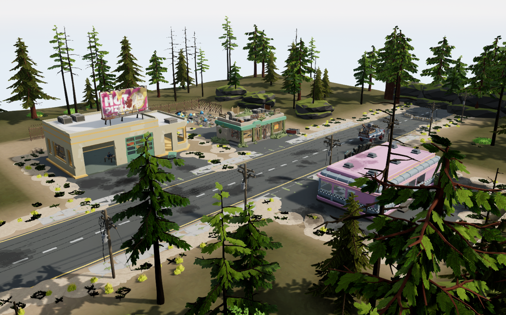

# 第六课：在真实地形上搭建末日街道切片

本课把上一课对完整 Woodland 示例的研究用于一个独立小街区：以一段道路连接修车铺、餐馆和小店，再用服务院落、围栏、单辆废车、破损路边和局部植物交代区域用途。先验证小范围的地形承接、模型接口和装饰密度，再决定如何扩大。

本课已在 UE 5.8.2 中保存重开并完成只读验证：**1,206 个模型实例、95 种模型、35 个贴花，核对零错误**。另记录 4 个编辑器观察机位，没有创建 CameraActor。124 次地面射线全部命中且高度匹配，6 条指定胶囊扫掠路线未被阻挡；这些结果限定于本次布局与检测参数，不等于导航、玩家玩法或性能验收。



## 资源与学习关卡

| 项目 | 本课配置 |
| --- | --- |
| 编辑器 | UE 5.8.2 |
| 原图参考 | POLYGON Woodland Apocalypse Map 1.0.0，UE 5.3 资源 |
| 城市模型 | POLYGON Apocalypse 1.21.1，UE 5.3 资源 |
| 自然资源 | POLYGON Nature Biomes Alpine Mountain 1.1.0，UE 5.3 资源 |
| 引用命名空间 | `/Game/Synty/PolygonApocalypse`、`/Game/Synty/PolygonMapsWoodlandApocalypse`、`/Game/Synty/PolygonNatureBiomes` 和 `/Game/Synty/PolygonGeneric`，以布局中的精确路径为准 |
| 独立地图 | `/Game/SyntySenceLearning/PolygonApocalypse/StreetSlice/L_StreetSlice` |
| 独立地形材质 | `StreetSlice/Materials/M_StreetLandscape`，从原 `M_Land_Woods` 复制后用于本课 |

本课使用新版 `/Game/Synty/...` 资源路径。前几课保留的 `/Game/PolygonApocalypse` 旧路径及同名模型不能直接代替本课引用；同名资源在不同版本中的枢轴与尺寸可能变化。原 Woodland Demo 与旧 AftermathTown 地图保留，本课的地形和材质调整限定在独立学习目录。

## 原场景观察与模型接口

前置阅读是第五课的[混乱地面研究](../05-aftermath-town/Notes/ChaoticGroundStudy.md)。其结论来自指定版本原图的真实节点、LOD0 截面、Landscape 查询和实际截图；这些是选型与搭配依据，不能直接当作新街区的接缝验收。

- **地形承接道路，局部土片覆盖边缘。** 原图中 Landscape、道路和有厚度的土片承担不同作用。Actor Z 相同不代表表面连续，土片 Actor 低于路面也可能在表面形成隆起。本课先控制道路与建筑前场的地形，再安排越过边界的小范围覆盖。
- **保留模块接口与建筑附件关系。** 路边坡口、凹口和沟槽按用途选择；破损片的旋转和高差留在局部。建筑门、招牌等附件按实测相对变换搬运，不能把门的枢轴当作门槛，也不能为了塞入地块缩放建筑主体。
- **装饰围绕使用痕迹集中。** 围栏、维修前场和废车附近形成不同密度，路面留出可读空间。原图垃圾组合有共用变换与独立偏移两种情况，组合时保留成员变换和实例材质，再检查在新地形上的接触关系。

三栋建筑分置道路两侧，修车铺前留服务空间，餐馆与小店形成不同的街面关系；围栏院落补充街道背后的用途。外围地形承担从硬质路面到草地的过渡，植物与碎物用于局部侵入，不把全部空地铺成均匀装饰层。

## Landscape 的实际构建方式

本课使用有真实组件的 UE Landscape：高度图分辨率 **127×127**，**2×2 个组件**，每组件 **1 个 section、63×63 quads**，XY 缩放为 100 cm，覆盖 **126×126 m**。127 是顶点数，126 是每轴相邻顶点之间的区间数。

高度与权重由 `Scripts/create_terrain.py` 生成，通过 **RGBA32F Render Target** 导入 Landscape。道路和院落附近保持受控承接高度，向外围平滑过渡到起伏；Dirt 与 Grass_02 权重控制土地区域和植被底色。权重是材质输入，不等同于最终画面中的可见面积比例。地形材质使用独立副本，保留原资源。

**必须先在 UE 原生 Landscape 界面创建真实地形组件。** 本机 MCP 源码检查显示，当前 UE 版本对应的 `create_landscape` 分支只生成 Actor，没有执行地形 Import；本课没有实际调用它创建地形。只有 Actor 名称或工具返回值不足以证明有地形，执行导入前需核对 4 个 LandscapeComponent、分辨率、位置、缩放和材质。

`create_terrain.py` 为 Base、Dirt、Grass_02 指定原 LayerInfo，并以 `ALWAYS` 通知模式重新设置独立地形材质，然后导入高度及三层权重。本次 4 项导入均返回 true。重开后曾短暂显示棋盘格，等待 shader 就绪后实际截图中的地形材质恢复正常；这不作为跨版本即时显示一致的保证。

## 复现流程

本课已验证保存重开后的最终地图，但尚未在另一个全空地图中独立重复完整构建。以下步骤包含必要的原生界面操作。

1. 在自己的 UE 工程安装上表对应版本及其共享依赖，保持布局引用的精确 `/Game/Synty/...` 路径，并启用 Python Editor Script Plugin 与 Editor Scripting Utilities。源资源、贴图、原始地图与派生资产二进制均不随仓库提供。
2. 在仓库根目录准备本课文件，把示例工程路径换成自己的 `.uproject`：

   ```powershell
   python tools/prepare_study.py --project "X:/YourProject/YourProject.uproject" --study street-slice
   ```

3. 保存当前工作，在 UE Python 中执行准备阶段。脚本自动从当前工程查找准备目录；它只在目标地图不存在时创建地图及独立材质，并拒绝在有未保存包时切图：

   ```python
   import runpy
   from pathlib import Path
   import unreal
   study = Path(unreal.Paths.project_dir()).resolve() / "Learning/SyntySenceLearning/polygon-apocalypse/06-street-slice"
   runpy.run_path(str(study / "Scripts/build_scene.py"))["main"]("prepare")
   ```

4. 在新打开的地图进入原生 Landscape 创建界面：Section Size 设为 63 Quads，Sections per Component 为 1，Number of Components 为 2×2，Scale 为 (100,100,100)，**界面中心 Location 填 (0,0,0)**，材质选择独立 `M_StreetLandscape`，然后创建。创建后 Actor 枢轴为 (-6300,-6300,0)，不要把该枢轴值再次填入创建界面的中心位置，否则会整体偏移。
5. 回到 UE Python，先导入地形，再构建模型、贴花和环境。下面每行按顺序执行，沿用第 3 步的 `study`：

   ```python
   runpy.run_path(str(study / "Scripts/create_terrain.py"))["main"]()
   runpy.run_path(str(study / "Scripts/build_scene.py"))["main"]()
   ```

   构建会预载引用资产，遇到已有 `STREET_` 或 `Town_` 场景内容时拒绝重复放置。MCP 超时后先检查实际地图状态，不要直接再次构建。`create_terrain.py` 会重新导入高度和权重，仅在确实要应用本课地形配方时运行。
6. 使用以下命令查看机位；参数可选 `overview`、`street`、`yard`、`edge`，省略时为 `overview`。机位来自 `Data/Cameras.json`，只改变编辑器视口：

   ```python
   runpy.run_path(str(study / "Scripts/set_view.py"))["main"]("street")
   ```

7. 保存本课资产，切换到其他地图，再重开 `L_StreetSlice`。等待 shader 就绪后检查画面，并执行只读核对：

   ```python
   runpy.run_path(str(study / "Scripts/verify_scene.py"))["main"](reloaded=True)
   ```

   `reloaded=True` 记录调用者已完成重开的事实，不会代替重开操作。新报告写入当前工程的学习目录，不依赖或覆盖仓库中的历史报告。

脚本应从自身位置与当前工程解析数据和输出路径，训练可准备到任意合适的本地工程。本课在原生 Landscape 创建步骤之后使用脚本构建，当前不宣称从全空工程无人值守地一键复现。

## 数据与验证范围

| 文件 | 用途 |
| --- | --- |
| `Data/Layout.json` | 自创街区的模型引用、实例变换、材质和分组 |
| `Data/AssemblyRecipes.json` | 6 组局部搭配、73 个选定节点的原变换、实例材质与目标变换；组合由本课整理，不代表源图均为同一个 Blueprint |
| `Data/Decals.json` | 贴花材质、投射尺寸和变换 |
| `Data/Cameras.json` | 实际检查街区的机位 |
| `Data/Validation.json` | 本课最终数量、只读验证及实际完成的检查 |
| `Data/TerrainBuild.json` | 高度、Base、Dirt、Grass_02 的本次导入结果 |
| `Data/SourceIntegrity.json` | 原 Demo、旧小城与原 M_Land_Woods 的哈希保护记录 |
| `Scripts/build_scene.py` | 构建独立学习街区 |
| `Scripts/create_terrain.py` | 向已创建的真实 Landscape 导入高度与权重 |
| `Scripts/verify_scene.py` | 只读核对当前场景 |
| `Scripts/set_view.py` | 切换学习机位 |
| `Scripts/environment.py` | 构建脚本调用的独立场景环境配置 |

本次保存与重开均成功，仓库 `verify_scene.py` 在重开后的地图中返回 completed、errors=0。地面检查覆盖 31 个指定位置，每处分别检查完整场景与仅 Landscape 的简单、复杂碰撞，共 124 条射线；全部命中且高度匹配。另有 6 条指定胶囊扫掠路线未阻挡，结果仅适用于报告中的轨迹与尺寸。原 Demo、旧小城与原 M_Land_Woods 三个源文件的哈希保持不变。

实际观察截图：[街面](Screenshots/street.png)、[服务院落](Screenshots/yard.png)、[路边过渡](Screenshots/edge.png)。实例一致性、射线高度、扫掠结果与画面观察分别记录；未完成的全接缝、导航、玩家玩法、性能、打包与商业游戏质量验收不计为通过。
